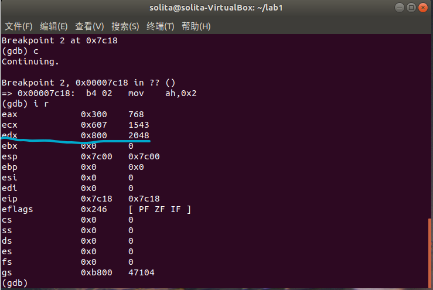

# Assignment1 MBR

## 1.1 Example1复现

Example1中详细讲述了如何利用开机时自启动进入的Master Boost Record编写一个简单的Hello World程序。本次复现的实验报告中会展示我编写的MBR代码，以及补充实验报告未明确说明的注意事项。

### 1.1.1 MBR代码编写

在该次实验中，需要注意如下的细节：

- BIOS自检完成之后会将控制权自动交给MBR运行，MBR的地址是`0x7c00`，但是不同的编译器设定的默认代码段起始位置很可能是不一样的，且很可能不符合我们的期望。因此在程序开头我们需要使用伪指令`org`使得编译器以MBR起始地址为代码段地址来编译代码。
- 本次实验只要求实现MBR中编写程序，进一步的bootloader不做要求，所以最后使用`times`伪指令做无限循环，让程序停在MBR中。
- 计算机会检查MBR是否具有有效内容，判断方法是检查MBR最后两个字节是否是`0x55`和`0xaa`，符合才会开始运行程序。因此MBR中实际可用空间只有510个字节，且编写完程序之后必须保证程序大小为514个字节，可以用`times`伪指令来填充实际代码中剩余空白部分，最后再填充两个校验字节。

- 在屏幕上显示字符时，显示矩阵的映射范围是`0xB8000~0xBFFFF`处，这一段地址称为显存地址。因此我们如果要显示地址，只用在程序中把对应的内存地址做修改就能显示文字了。

最后编写的MBR代码如下。

```assembly
org 0x7c00
[bits 16]

xor ax,ax
mov ds,ax
mov ss,ax
mov es,ax
mov fs,ax
mov gs,ax

mov sp,0x7c00
mov ax,0xb800
mov gs,ax

mov ah,0x01
mov al,'H'
mov [gs:2*0],ax

mov al,'e'
mov [gs:2*1],ax

mov al,'l'
mov [gs:2*2],ax

mov al,'l'
mov [gs:2*3],ax

mov al,'o'
mov [gs:2*4],ax

mov al,' '
mov [gs:2*5],ax

mov al,'W'
mov [gs:2*6],ax

mov al,'o'
mov [gs:2*7],ax

mov al,'r'
mov [gs:2*8],ax

mov al,'l'
mov [gs:2*9],ax

mov al,'d'
mov [gs:2*10],ax

jmp $

times 510-($-$$) db 0
db 0x55,0xaa
```

### 1.1.2 装载MBR

首先我们当然要把写好的文件转化为二进制可执行文件。

```bash
nasm -f bin mbr.asm -o mbr.bin
```

我们在第一次实验已经装配好了相应的内核。现在我们为虚拟机开一个虚拟硬盘，`qemu`给我们提供了相应的指令。我们开一个名字为`hd`，大小为10Mbit的硬盘。

```bash
qemu-img create hd.img 10m
```

最后把二进制可执行文件写入这个硬盘的首512个字节中。

```bash
dd if=mbr.bin of=hd.img bs=512 count=1 seek=0 conv=notrunc
```

最后启动虚拟机。

```bash
qemu-system-i386 -hda hd.img -serial null -parallel stdio
```

虚拟机运行界面如下。


可以看到有如下情况：

- 成功显示出了蓝色的`Hello World`
- 虚拟机一只卡在`Booting from Hard Disk`中。这也可以理解，因为我们的`mdr`中没有写进一步的操作。

## 1.2 Example1修改

题目要求我们在`(12,12)`处开始输出学号，且要求景色与背景色不同。

**只要修改`ah`改变背景颜色和字体颜色，`gs`改变显示位置即可。**

屏幕的显示矩阵大小是`25x80`。因此位置计算公式如下。
$$
Address=\texttt{0xB8000}+2\times(80x+y)
$$
我们把背景颜色改为绿色，字体改成黄色。即`al=0010 1110`即可。

最后编写的代码如下。

```assembly
org 0x7c00
[bits 16]

xor ax,ax
mov ds,ax
mov ss,ax
mov es,ax
mov fs,ax
mov gs,ax

mov sp,0x7c00
mov ax,0xb800
mov gs,ax

mov ah,00101110b
mov al,'2'
mov [gs:2*80*12+2*12],ax

mov al,'2'
mov [gs:2*80*12+2*13],ax

mov al,'3'
mov [gs:2*80*12+2*14],ax

mov al,'0'
mov [gs:2*80*12+2*15],ax

mov al,'5'
mov [gs:2*80*12+2*16],ax

mov al,'0'
mov [gs:2*80*12+2*17],ax

mov al,'5'
mov [gs:2*80*12+2*18],ax

mov al,'3'
mov [gs:2*80*12+2*19],ax

jmp $

times 510-($-$$) db 0
db 0x55,0xaa
```

最后程序运行结果如下。


（不得不提代码最后写死循环不是一个好写法，进程被一直占用导致电脑很卡）

# Assignment2 实模式中断

## 2.1 光标中断实现位置获取与移动

系统已经提供了相应的功能号让我们使用中断例程来实现程序。

| 功能             | 功能号 | 参数                                       | 返回值                                                   |
| ---------------- | ------ | ------------------------------------------ | -------------------------------------------------------- |
| 设置光标位置     | 02H    | BH=页码，DH=行，DL=列                      | 无                                                       |
| 获取光标位置形状 | 03H    | BX=页码                                    | AX=0，CH=行扫描开始，CL=行扫描结束，DH=行位置，DL=列位置 |
| 在当前位置写字符 | 09H    | AL=字符，BH=页码，BL=颜色，CX=输出字符个数 | 无                                                       |

为了方便调试，先给出几个常用指令：

- 查看寄存器：`i r`
- 单步执行：`si`
- 设置断点：`b`
- 继续连续实行函数：`c`
- 显示下一步指令：`set disassemble-next-line on`
- 以intel风格显示汇编指令：`set disassembly-flavor intel`

根据上述条件，我期望写一个程序，第一步获取光标位置，第二步移动光标位置，最终使用远程调试一步一步进行看看是否达成目标。

### 2.1.1 MBR代码

```assembly
org 0x7c00
[bits 16]

xor ax,ax
mov ds,ax
mov ss,ax
mov es,ax
mov fs,ax
mov gs,ax

mov sp,0x7c00
mov ax,0xb800
mov gs,ax

mov ah,03h
int 10h

mov ah,02h
add dl,1
int 10h

mov ah,03h
int 10h

jmp $

times 510-($-$$) db 0
db 0x55,0xaa
```

### 2.2.2 逐步执行观察效果

编译这个文件。

```bash
nasm -f bin mbr_2_1.asm -o mbr_2_1.bin -g
```

写入文件。

```bash
dd if=mbr_2_1.bin of=hd.img bs=512 count=1 seek=0 conv=notrunc
```

以debug模式启动虚拟机。

```bash
qemu-system-i386 -hda hd.img -serial null -parallel stdio -s -S
```

我使用gdb进行远程调试。连接成功之后，我们设置断点。

```bash
b *0x7c00
```

然后用c命令执行到相应位置，并设置好语言格式，如下图所示。


此时我们可以看到红圈处，这是此时光标的位置（正在不断闪烁）。我们来看看这个位置是多少。

首先我们一步步执行到这一部分。

```assembly
mov ah,03h
int 10h
```

然后通过打断点并继续执行的办法跳过`int 10h`函数，最后使用`i r`查看寄存器内容。gdb界面如下。



可以看到，此时`DX`寄存器的值是`0x2048`，二进制是`0010 0000 0100 1000`

**这说明这个光标的位置是在32行72列处**。看得出来这个位置和我们看上去的位置并不是一一对应的关系。

然后我们把光标右移，也就是把`DL`加1。

将如下代码运行。

```assembly
mov ah,02h
add dl,1
int 10h
```

最后截图如下。


可以看到，光标真的向右移了一位。我们的程序正确运行了。

## 2.2 光标中断输出代码

我们可以修改`1.2`的程序了。

### 2.2.1 实现思路

只要我们先获取光标的位置，然后把`dl`和`dh`都加12，然后再在当前位置写一次，再在移动，不断以此下去写八次即可。

### 2.2.2 实现代码

```assembly
org 0x7c00
[bits 16]

xor ax,ax
mov ds,ax
mov ss,ax
mov es,ax
mov fs,ax
mov gs,ax

mov sp,0x7c00
mov ax,0xb800
mov gs,ax

mov ah,03h
int 10h

mov ah,02h
add dl,12
add dh,12
int 10h

mov al,'2'
mov bl,00101110b
mov cx,2
mov ah,9h
int 10h
add dl,2
mov ah,2h
int 10h

mov al,'3'
mov bl,01001110b
mov cx,1
mov ah,9h
int 10h
add dl,1
mov ah,2h
int 10h

mov al,'0'
mov bl,10001010b
mov cx,1
mov ah,9h
int 10h
add dl,1
mov ah,2h
int 10h

mov al,'5'
mov bl,01101010b
mov cx,1
mov ah,9h
int 10h
add dl,1
mov ah,2h
int 10h

mov al,'0'
mov bl,00001100b
mov cx,1
mov ah,9h
int 10h
add dl,1
mov ah,2h
int 10h

mov al,'5'
mov bl,01100110b
mov cx,1
mov ah,9h
int 10h
add dl,1
mov ah,2h
int 10h

mov al,'3'
mov bl,11100110b
mov cx,1
mov ah,9h
int 10h
add dl,1
mov ah,2h
int 10h

jmp $

times 510-($-$$) db 0
db 0x55,0xaa
```

我们这次就不进调试模式了，直接虚拟机，启动！


可以看到程序执行情况还是很良好的。

## 2.3 从键盘输入并回显

通过查询相关资料可知，键盘I/O中断有三个功能号012，中断码是`16h`。

- 0号实现从键盘读入字符并送往`AL`。
- 1号查询键盘缓冲区，对键盘扫描但不等待，如果有按键操作就置`ZF`为0，否则为1.
- 2号用来检测键盘各个功能键的状态，并把状态送给`AL`。

显然我们只用0号就足够了。

### 2.3.1 实现思路

我们写一个循环。先从键盘读入，再显示到屏幕上，再移动一个光标，再循环回去，即可实现目的。

### 2.3.2 实现代码

```assembly
org 0x7c00
[bits 16]

xor ax,ax
mov ds,ax
mov ss,ax
mov es,ax
mov fs,ax
mov gs,ax

mov sp,0x7c00
mov ax,0xb800
mov gs,ax

mov ah,03h
int 10h

proc	mov ah,0
	int 16h
	
	mov bl,00001100b
	mov cx,1
	mov ah,9h
	int 10h
	mov ah,02h
	add dl,1
	int 10h
	jmp proc
	

jmp $

times 510-($-$$) db 0
db 0x55,0xaa
```

最后在虚拟机上跑一跑，截图如下


我们敲入几个字看看


可以看到程序很好地执行了功能。不过回车和回退都没有办法检测到，略显可惜。

# Assignment3 汇编

在此之前，为了在后续编写汇编程序时方便，我先找出了几个常用的指令的用法。

| 指令 | 用法                                                         |
| ---- | ------------------------------------------------------------ |
| loop | 所有循环指令都是**短转移**。`CX`存储循环次数，每到loop一次减一，检测到变零跳出循环。 |
| jmp  | 直接跳转到对应位置                                           |
| add  | 加                                                           |
| sub  | 减                                                           |
| mul  | 乘                                                           |
| div  | 用法是`div s`，运算方法是`eax/s`，商存入`eax`，余数存入`edx`。无符号除法，`idiv`是有符号除法。 |
| neg  | 取负                                                         |
| inc  | 自增                                                         |
| dec  | 自减                                                         |
| and  | 与                                                           |
| or   | 或                                                           |
| not  | 非                                                           |
| xor  | 异或                                                         |
| shl  | 左移                                                         |
| shr  | 右移                                                         |
| mov  | 数据转移                                                     |

`cmp`判断指令有些复杂，在下列表解释。

| CMP无符号数比较结果 | ZF   | CF   |
| ------------------- | ---- | ---- |
| <                   | 0    | 1    |
| >                   | 0    | 0    |
| =                   | 1    | 0    |

| CMP有符号数比较结果 | 响应       |
| ------------------- | ---------- |
| <                   | `SF != OF` |
| >                   | `SF == OF` |
| =                   | `ZF == 1`  |

各种跳转指令的用法如下。

| 跳转指令 | 跳转条件        |
| -------- | --------------- |
| jz       | zf=1            |
| jnz      | zf=0            |
| jc       | cf=1            |
| jnc      | cf=0            |
| jo       | of=1            |
| jno      | of=0            |
| js       | sf=1            |
| jns      | sf=0            |
| jp       | pf=1            |
| jnp      | pf=0            |
| je       | 两数相等        |
| jne      | 两数不等        |
| jcxz     | cx=0            |
| jecxz    | ecx=0           |
| ja/jnbe  | 无符号数 多于   |
| jae/jnb  | 无符号数 不少于 |
| jb/jnae  | 无符号数 少于   |
| jbe/jna  | 无符号数 不多于 |

## 3.1 分支逻辑

```assembly
your_if:
; put your implementation here
	mov eax,[a1]
	cmp eax,12
	jb pro1
	cmp eax,24
	jb pro2
	jmp pro3
pro1	shr eax,1
	inc eax
	mov edx,[if_flag]
	mov edx,eax
	jmp exit1
pro2	mov edx,24
	sub edx,eax
	mov eax,edx
	mov ebx,[a1]
	mul ebx
	mov [if_flag],edx
	jmp exit1
pro3	mov edx,eax
	shl edx,4
exit1	mov [if_flag],edx
```

## 3.2 存入字符

```assembly
your_while:
; put your implementation here
	mov ecx,[a2]
pro4	cmp ecx,12
	jb exit2
	call my_random
	mov edi,ecx
	sub edi,12
	add edi,[while_flag]
	mov [edi],eax
	sub ecx,1
	jmp pro4
exit2	mov [a2],ecx
```

## 3.3 函数调用实现

```assembly
your_function:
; put your implementation here

	push ecx
	push edi
	push edx
	mov ecx,0
	mov edi,[your_string]
pro5	
	cmp byte [edi],'\0'
	jz exit3
	pushad
	mov eax,[edi]
	push eax
	call print_a_char
	pop eax
	popad
	add edi,1
	jmp pro5
exit3	pop edx
	pop edi
	pop ecx
	ret
```

## 3.4 实现截图


可以看到，即使我不知道函数中部分值的内容，因为函数写得正确，程序正确地执行了。

# Assignment4 弹射程序

## 4.1 算法思路

因为有反射弹回的设计，因此我们需要两个变量，用来记录此时字符的位置。当字符的位置超过屏幕边界时就将变量从加变减。从而实现字符位置的”弹射“。

同时在算法实现的过程中，我发现在载入字符时遇到了一些麻烦，我通过将边界改为屏幕边长的两倍，每次增减2才能得到正确的答案。为什么会出现这个现象？仍然需要进一步的研究。

不过本次实验使用上述方法能够正确运行。

同时，nasm编译器的语法规则与DOSBox的编译器的语法规则稍有不同，有些指令需要查阅nasm标准文档来排查语法错误。

比如，`mov WORD PTR [num],1`不被允许，因为nasm编译器中不支持`PTR`语法，需要更改成`mov WORD [num],1`

再比如，`[gs:ax]`的寻址模式不被允许，偏移地址必须接受32位寄存器，需要更改成`[gs:eax]`

还有非常多的变量不允许直接操作的问题。

种种语法不匹配的问题以及屏幕输出的问题是本次实验中最困难的部分，让我折腾了相当长的一段时间。

## 4.2 代码展示

源代码如下。

```assembly
org 0x7c00
[bits 16]

section .data
	num db 0
	string db 48
	color dw 00000010b
	xAddr dw 2
	yAddr dw 0
	xMax dw 80*2-1
	yMax dw 25*2-2
	xflag db 1
	yflag db 1
	delay_time dw 0xFFFF

_start:
xor ax,ax
mov ds,ax
mov ss,ax
mov es,ax
mov fs,ax
mov gs,ax

mov sp,0x7c00
mov ax,0xb800
mov gs,ax

;load number
proc:
	;mod fuction
	add byte [num],1
	mov al,[num]
	cmp al,10
	jne next1
	mov al,0
	mov byte [num],al
next1:	add word [color], 00100010b
	
	;change ASCII
	add al,'0'
	mov byte [string],al

	;count address
	jmp count_address
proc1:
	;GS address
	mov eax,0
	mov ebx,0
	mov ax, [yAddr]
	mov bx,80
	mul bx
	add ax, [xAddr]
	mov bx,ax

	;All in!
	mov eax,0
	mov ax,bx
	mov dh,[color]
	mov dl,[string]
	mov WORD [gs:eax], dx

	;delay time
	mov cx,delay_time
delay_loop:
	nop
	mov bx,delay_time
loop2:
	dec bx
	cmp bx,0
	nop
	jne loop2
	nop
	loop delay_loop
	jmp proc


count_address:
	cmp byte [xflag], 1
	je add_value_x
	jmp sub_value_x
add_value_x:
	inc word [xAddr]
	inc word [xAddr]
	mov ax,[xAddr]
	cmp ax, [xMax]
	jle y_count
	mov byte [xflag],0
	jmp y_count
sub_value_x:
	dec word [xAddr]
	dec word [xAddr]
	cmp word [xAddr],2
	jge y_count
	mov byte [xflag],1
	jmp y_count
y_count:
	cmp byte [yflag], 1
	je add_value_y
	jmp sub_value_y
add_value_y:
	inc word [yAddr]
	inc word [yAddr]
	mov ax,[yAddr]
	cmp ax, [yMax]
	jle proc1
	mov byte [yflag],0
	jmp proc1
sub_value_y:
	dec word [yAddr]
	dec word [yAddr]
	cmp word [yAddr],0
	jge proc1
	mov byte [yflag],1
	jmp proc1

times 510-($-$$) db 0
db 0x55,0xaa
```

## 4.3 运行

编译这个文件。

```bash
nasm -f bin mbr_2_4.asm -o mbr_2_4.bin -g
```

写入文件。

```bash
dd if=mbr_2_4.bin of=hd.img bs=512 count=1 seek=0 conv=notrunc
```

以debug模式启动虚拟机。

```bash
qemu-system-i386 -hda hd.img -serial null -parallel stdio
```

运行的结果如下：


