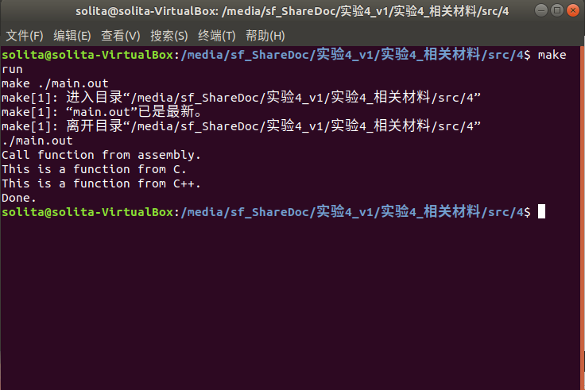
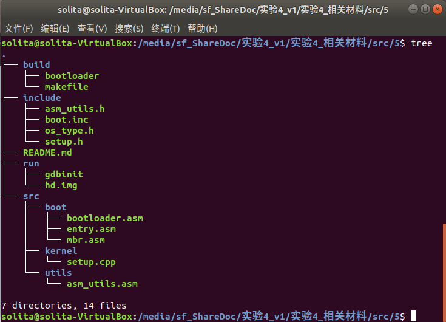
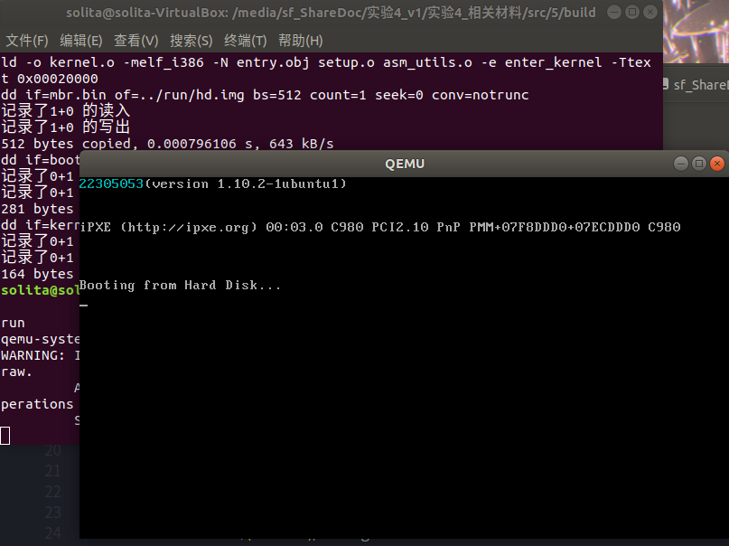
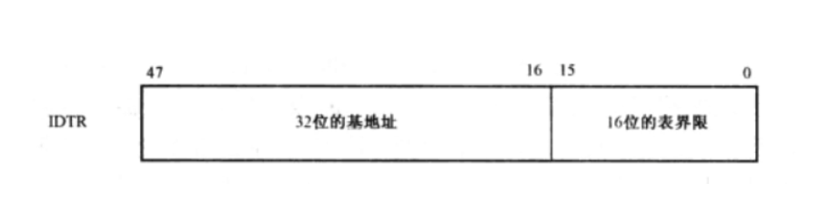
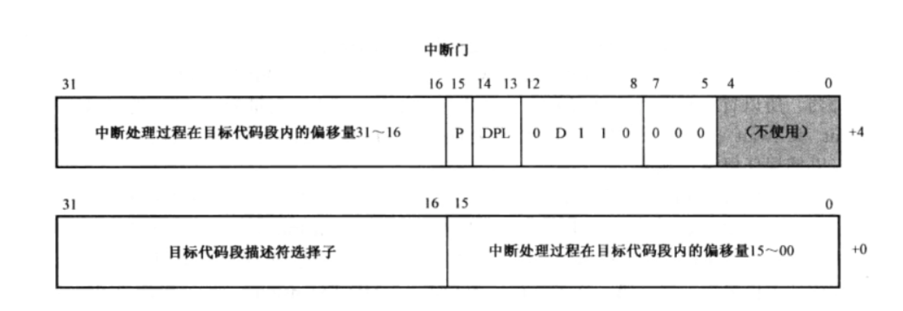
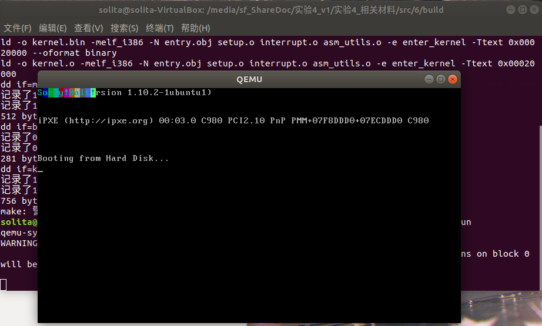
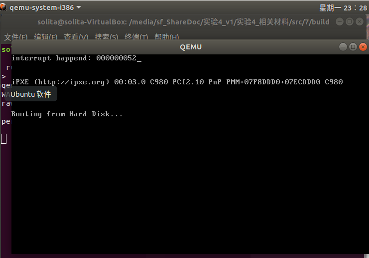
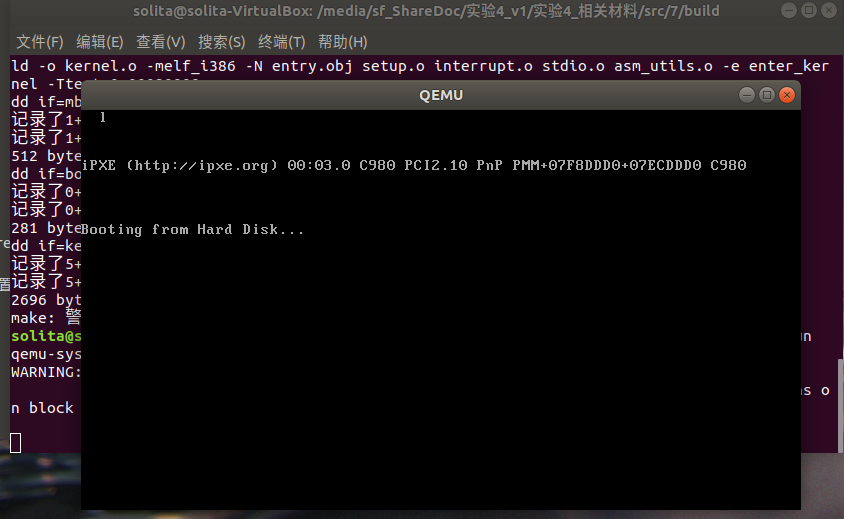
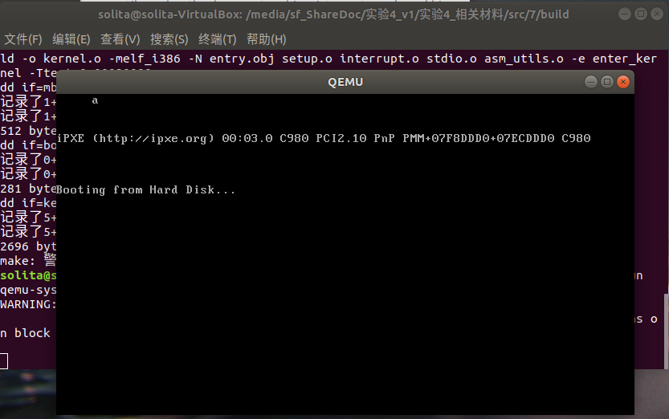

> 声明：本实验报告中对复现任务的解释都是作者个人见解和对实验指导未解释部分的补充，同时也是作者的学习笔记，而非单纯对实验指导的复制粘贴。

# Assignment 1

## 1.1 定义函数

本次实验要求使用三种语言来定义函数。最终调用的主程序是`cpp`文件。

整个函数的逻辑如下。

- 函数`main`（CPP）
  - 调用函数`function_from_asm`（来自ASM）
    - 调用`function_from_C`（来自C）
    - 调用`function_from_CPP`（来自CPP）

我们从内到外定义函数。

### 1.1.1 c_func.c

定义`function_from_C`。

```c
#include <stdio.h>

void function_from_C() {
    printf("This is a function from C.\n");
}
```

C语言编译时会保留其原来的函数名。因此不需要做过多操作。

### 1.1.2 cpp_func.cpp

定义`function_from_CPP`

```cpp
#include <iostream>

extern "C" void function_from_CPP() {
    std::cout << "This is a function from C++." << std::endl;
}
```

**注：因为C++支持函数重载，因此正常情况下，编译后的函数名不再是原来的函数名。**

因此需要使用`extern "C"`指令，使其函数编译规则与C保持一致。

### 1.1.3 function_from_asm

定义`function_from_asm`

```asm
[bits 32]
global function_from_asm
extern function_from_C
extern function_from_CPP

function_from_asm:
    call function_from_C
    call function_from_CPP
    ret
```

在这次的复现中，两个被调用的函数都没有返回值，所以暂且不用关心调用外部函数后返回值放在哪里。

同样，这个函数本身也没有返回值，因此这次不需要关注汇编函数返回值应该存放在哪里的问题。

如果这个函数本身有返回值，统一放在`eax`的位置。

### 1.1.4 main.cpp

```cpp
#include <iostream>

extern "C" void function_from_asm();

int main() {
    std::cout << "Call function from assembly." << std::endl;
    function_from_asm();
    std::cout << "Done." << std::endl;
}
```

同样，需要使用`extern "C"`指令，使其函数编译规则与C保持一致。

## 1.2 Makefile

makefile文件的本质是将所有指令打包，由编译器执行。

最后根据我们上述的文件，编写makefile文件。

```makefile
main.out: main.o c_func.o cpp_func.o asm_func.o
	g++ -o main.out main.o c_func.o cpp_func.o asm_func.o -m32

c_func.o: c_func.c
	gcc -o c_func.o -m32 -c c_func.c

cpp_func.o: cpp_func.cpp
	g++ -o cpp_func.o -m32 -c cpp_func.cpp 

main.o: main.cpp
	g++ -o main.o -m32 -c main.cpp

asm_func.o: asm_func.asm
	nasm -o asm_func.o -f elf32 asm_func.asm
	
run:
	make ./main.out
	./main.out
	
clean:
	rm *.o
```

我们可以知道，最后合成的可执行文件后缀是`.o`。

上述的gcc指令在实验报告中已经有解释，我解释一下nasm中指令的含义。

- **-o asm_func.o**：这部分指定了生成的目标文件的名称为 **asm_func.o**。
- **-f elf32**：这部分指定了目标文件的格式。在这里，我们使用 **elf32** 格式，它是一种适用于 **Linux** 系统的目标文件格式。
- **asm_func.asm**：汇编源代码文件的名称。

最后，如果我们没有定义`run`的话，程序若要在终端运行，需要两行指令。

```bash
make ./main.out
./main.out
```

定义之后就只需要一条指令了。

```bash
make run
```

## 1.3 执行结果

最后执行代码的截图如下。



可以看到最后的代码结果和我们想象的一致。

# Assignment 2

这次实验设计大项目。因此我们所有文件应该放在一个根目录下。

在进行复现前，实验指导中没有说明这个漂亮的文件目录是怎么生成的。

```shell
├── build
│   └── makefile
├── include
│   ├── asm_utils.h
│   ├── boot.inc
│   ├── os_type.h
│   └── setup.h
├── run
│   ├── gdbinit
│   └── hd.img
└── src
    ├── boot
    │   ├── bootloader.asm
    │   ├── entry.asm
    │   └── mbr.asm
    ├── kernel
    │   └── setup.cpp
    └── utils
        └── asm_utils.asm
```

这里给出方法。

首先安装`tree`库。

```bash
sudo apt intstall tree
```

然后直接使用如下指令。

```bash
tree
```

就能在终端中显示这个漂亮的文件目录。



实验将各个文件分门别类。这在后期管理大型项目时非常有用。

## 2.1 实验思路

操作系统，亦或者说，内核本身只是一段可执行代码。内核的内容是什么，完全可以有我们自己定义。写完内核之后，代码仍然需要加载到内存中，才能运行。

因此为了加载内核，需要做以下几件事。

- 编写好对应的`mbr`和`bootloader`。此时`bootloader`要做的事情只有把操作系统内核到内存中某一个位置并跳转。这里我们定义这个起始处为`0x20000`，定义内核在硬盘上的第六个扇区中，假设硬盘有200个扇区。
- 操作系统内核编写对应程序。这里我们写一个`Hello World`程序。

## 2.2 bootloader程序

`bootloader`的作用如下。

- 先进入保护模式
- 再加载内核

因此们只需要基于实验三的程序做修改即可。加载内核的过程还和`mbr`加载`bootloader`的过程几乎一模一样，只是起始地址，起始盘和加载次数发生了变化。

`bootloader`的关键改动如下。其中的`asm_read_hard_disk`是直接复用`mbr`中的代码。

```asm
mov eax, KERNEL_START_SECTOR
mov ebx, KERNEL_START_ADDRESS
mov ecx, KERNEL_SECTOR_COUNT

load_kernel: 
    push eax
    push ebx
    call asm_read_hard_disk  ; 读取硬盘
    add esp, 8
    inc eax
    add ebx, 512
    loop load_kernel

jmp dword CODE_SELECTOR:KERNEL_START_ADDRESS 
```

`boot.inc`新增以下内容。

```asm
; __________kernel_________
KERNEL_START_SECTOR equ 6
KERNEL_SECTOR_COUNT equ 200
KERNEL_START_ADDRESS equ 0x20000
```

## 2.3 内核编写

内核是一组程序的集合。

因此我们可以用分体思想编写一个简单的内核。该内核的逻辑如下。

- 内核接管。这里我们设置为跳转到`setup_kernel`程序。
- 编写初始化内核的程序。这里使用汇编编写学号程序，练习外部链接。

内核接管程序如下。

```asm
global enter_kernel
extern setup_kernel
enter_kernel:
    jmp setup_kernel
```

初始化内核程序如下。

```cpp
#include "asm_utils.h"

extern "C" void setup_kernel()
{
    asm_hello_world();
    while(1) {

    }
}
```

```cpp
// "asm_utils.h"头文件定义
#ifndef ASM_UTILS_H
#define ASM_UTILS_H

extern "C" void asm_hello_world();

#endif
```

其中的学号程序编写如下。

```asm
[bits 32]

global asm_hello_world

asm_hello_world:
    push eax
    xor eax, eax

    mov ah, 0x03 ;青色
    mov al, '2'
    mov [gs:2 * 0], ax

    mov al, '2'
    mov [gs:2 * 1], ax

    mov al, '3'
    mov [gs:2 * 2], ax

    mov al, '0'
    mov [gs:2 * 3], ax

    mov al, '5'
    mov [gs:2 * 4], ax

    mov al, '0'
    mov [gs:2 * 5], ax

    mov al, '5'
    mov [gs:2 * 6], ax

    mov al, '3'
    mov [gs:2 * 7], ax

    pop eax
    ret
```

**这里不使用cpp程序直接编写的原因可能是因为虚拟机的屏幕映射问题。**

## 2.4 编译文件

首先我们理清楚我们要做什么。

- 首先编译`mbr`和`bootloader`。
- 然后编译内核代码。内核代码最后应该是**一个**可执行的二进制代码。
  - 先单独编译`entry.asm`，`asm_utils.asm`和`setup.cpp`。
  - 再链接三个文件。
    - 我们要求内核代码的起始位置必须是我们期望的地址。因此在重定位时，我们必须将`entry.obj`的位置放在指令首位。
    - 最后生成的程序是直接塞在内存中运行的，因此我们生成的文件应该是`bin`文件，而不是一个完整的`o`文件。但是完整的`o`可以用来调试使用。使用`.o`文件进行调试可比用`.bin`文件调试舒服太多了。因此我们可以同时生成两个文件。
- 把三个代码塞进内存中。
- 启动虚拟机。

### 2.4.1 编译 mbr 和 bootloader

```bash
nasm -o mbr.bin -f bin -I../include/ ../src/boot/mbr.asm
nasm -o bootloader.bin -f bin -I../include/ ../src/boot/bootloader.asm
```

### 2.4.2 编译内核代码

除了最终我们生成的内核代码应该是不夹杂任何多余项的`bin`文件，在进行链接时的文件必须是可重定位文件，在Linux中，这种文件格式是`ELF32`。

首先编译三个单独的文件。

```bash
nasm -o entry.obj -f elf32 ../src/boot/entry.asm
nasm -o asm_utils.o -f elf32 ../src/utils/asm_utils.asm
g++ -g -Wall -march=i386 -m32 -nostdlib -fno-builtin -ffreestanding -fno-pic -I../include -c ../src/kernel/setup.cpp
```

各个参数在实验指导中讲解得很详细。

然后链接成用来写进内存的`bin`文件。

```bash
ld -o kernel.bin -melf_i386 -N entry.obj setup.o asm_utils.o -e enter_kernel -Ttext 0x00020000 --oformat binary
```

当然，为了调试，我们可以生成`o`文件。

```bash
ld -o kernel.o -melf_i386 -N entry.obj setup.o asm_utils.o -e enter_kernel -Ttext 0x00020000
```

### 2.4.3 把 bin 文件塞进内存中

```bash
dd if=mbr.bin of=../run/hd.img bs=512 count=1 seek=0 conv=notrunc
dd if=bootloader.bin of=../run/hd.img bs=512 count=5 seek=1 conv=notrunc
dd if=kernel.bin of=../run/hd.img bs=512 count=200 seek=6 conv=notrunc
```

### 2.4.4 启动虚拟机

```bash
qemu-system-i386 -hda ../run/hd.img -serial null -parallel stdio -no-reboot
```

## 2.5 Makefile

如果直接在终端中执行2.4中的所有指令，会有以下麻烦。

- 操作过于繁琐。
- 每一个指令需要在不同的文件夹下打开终端来执行。

因此我们需要编写Makefile简化这个过程。

我们需要Makefile包含如下内容。

- 指明编译使用到的的工具包。
- 指明文件所在的位置。
- 指明用到的所有文件
- 指明编译完的文件应该放在哪里。
- 指明执行的指令

因此，在Makefile的开头，我们可以像定义常量一样，定义一些路径和工具。所有的定义本质上都是定义字符串。

```makefile
C_COMPLIER = gcc
CXX_COMPLIER = g++
CXX_COMPLIER_FLAGS = -g -Wall -march=i386 -m32 -nostdlib -fno-builtin -ffreestanding -fno-pic
LINKER = ld

SRCDIR = ../src
RUNDIR = ../run
BUILDDIR = build
INCLUDE_PATH = ../include

CXX_SOURCE += $(wildcard $(SRCDIR)/kernel/*.cpp)
CXX_OBJ += $(CXX_SOURCE:$(SRCDIR)/kernel/%.cpp=%.o)

ASM_SOURCE += $(wildcard $(SRCDIR)/utils/*.asm)
ASM_OBJ += $(ASM_SOURCE:$(SRCDIR)/utils/%.asm=%.o)

OBJ += $(CXX_OBJ)
OBJ += $(ASM_OBJ)
```

下面的六条指令需要逐条解释。

- `CXX_SOURCE += $(wildcard $(SRCDIR)/kernel/*.cpp)`
  - 这一行代码使用`wildcard`函数查找指定目录下所有的`.cpp`文件，并将它们的路径保存在`CXX_SOURCE`变量中。通常`$(SRCDIR)/kernel/*.cpp`表示源代码目录下的`kernel`子目录中的所有`.cpp`文件。
- `CXX_OBJ += $(CXX_SOURCE:$(SRCDIR)/kernel/%.cpp=%.o)`
  - 这一行代码将`CXX_SOURCE`中的每个`.cpp`文件路径替换为对应的`.o`文件路径，并将结果保存在`CXX_OBJ`变量中。例如，如果`CXX_SOURCE`包含了`kernel/foo.cpp`，那么对应的`.o`文件路径会是`kernel/foo.o`。
- `ASM_SOURCE += $(wildcard $(SRCDIR)/utils/*.asm)`
  - 这一行代码和第一行类似，只不过它是用于汇编语言（Assembly）文件，查找指定目录下所有的`.asm`文件，并将它们的路径保存在`ASM_SOURCE`变量中。
- `ASM_OBJ += $(ASM_SOURCE:$(SRCDIR)/utils/%.asm=%.o)`
  - 这一行代码和第二行类似，将`ASM_SOURCE`中的每个`.asm`文件路径替换为对应的`.o`文件路径，并将结果保存在`ASM_OBJ`变量中。
- `OBJ += $(CXX_OBJ)`
  - 这一行代码将C++源文件编译生成的目标文件路径添加到总的目标文件列表`OBJ`中。
- `OBJ += $(ASM_OBJ)`
  - 这一行代码将汇编语言源文件编译生成的目标文件路径也添加到总的目标文件列表`OBJ`中，以便最终链接。

接下来，我们就可以开始把所有终端指令转化为makefile指令。

```makefile
build : mbr.bin bootloader.bin kernel.bin kernel.o
	dd if=mbr.bin of=$(RUNDIR)/hd.img bs=512 count=1 seek=0 conv=notrunc
	dd if=bootloader.bin of=$(RUNDIR)/hd.img bs=512 count=5 seek=1 conv=notrunc
	dd if=kernel.bin of=$(RUNDIR)/hd.img bs=512 count=145 seek=6 conv=notrunc
# nasm的include path有一个尾随/
```

```makefile
mbr.bin : $(SRCDIR)/boot/mbr.asm
	$(ASM_COMPILER) -o mbr.bin -f bin -I$(INCLUDE_PATH)/ $(SRCDIR)/boot/mbr.asm
```

```makefile
bootloader.bin : $(SRCDIR)/boot/bootloader.asm 
	$(ASM_COMPILER) -o bootloader.bin -f bin -I$(INCLUDE_PATH)/ $(SRCDIR)/boot/bootloader.asm
```

```makefile
entry.obj : $(SRCDIR)/boot/entry.asm
	$(ASM_COMPILER) -o entry.obj -f elf32 $(SRCDIR)/boot/entry.asm
```

```makefile
kernel.bin : entry.obj $(OBJ)
	$(LINKER) -o kernel.bin -melf_i386 -N entry.obj $(OBJ) -e enter_kernel -Ttext 0x00020000 --oformat binary
```

```makefile
kernel.o : entry.obj $(OBJ)
	$(LINKER) -o kernel.o -melf_i386 -N entry.obj $(OBJ) -e enter_kernel -Ttext 0x00020000
```

```makefile
asm_utils.o : $(SRCDIR)/utils/asm_utils.asm
	$(ASM_COMPILER) -o asm_utils.o -f elf32 $(SRCDIR)/utils/asm_utils.asm
```

上述对asm编译中都是逐条编译，逐条改写。

我们可以直接使用上述我们定义好的常量直接对多个文件批处理编译，更加快速。

如下指令，我对所有的C和Cpp文件进行批处理。

```makefile
$(CXX_OBJ):
	$(CXX_COMPLIER) $(CXX_COMPLIER_FLAGS) -I$(INCLUDE_PATH) -c $(CXX_SOURCE)
```

最后我们写上启动程序和其他处理程序。

```makefile
clean:
	rm -f *.o* *.bin 
```

```makefile
run:
	qemu-system-i386 -hda $(RUNDIR)/hd.img -serial null -parallel stdio -no-reboot
```

```makefile
debug: 
	qemu-system-i386 -S -s -parallel stdio -hda $(RUNDIR)/hd.img -serial null&
	@sleep 1
	gnome-terminal -e "gdb -q -tui -x $(RUNDIR)/gdbinit"
```

注：这里的debug不是必要的。其中有一些陌生的指令，我在此解释一下。

- `qemu-system-i386 -S -s -parallel stdio -hda $(RUNDIR)/hd.img -serial null&`
  
  这一行命令使用 QEMU 模拟器来运行编译后的程序。具体参数的含义如下：
  
  - `-S`：表示在启动时暂停 CPU，等待调试器连接。
  - `-s`：表示启动一个 GDB 服务器，监听本地端口 1234，以便 GDB 连接。
  - `-parallel stdio`：表示将 QEMU 的标准输入和标准输出重定向到当前终端。
  - `-hda $(RUNDIR)/hd.img`：指定硬盘镜像文件路径，`$(RUNDIR)/hd.img`是一个变量，可能是在Makefile中定义的。
  - `-serial null`：表示将串行端口重定向到`null`，即关闭串行输出。
  - `&`：表示在后台运行 QEMU。
  
- `@sleep 1`

  这一行命令暂停当前的 Makefile 执行，等待一秒钟，以确保 QEMU 已经完全启动。

- `gnome-terminal -e "gdb -q -tui -x $(RUNDIR)/gdbinit"`
  
  这一行命令打开一个新的 GNOME 终端，并在其中启动 GDB 调试器。具体参数的含义如下：
  
  - `gnome-terminal`：表示启动 GNOME 终端。
  - `-e "gdb -q -tui -x $(RUNDIR)/gdbinit"`：表示在终端中执行 GDB 调试器，并指定了一些参数：
    - `-q`：表示以“安静模式”启动 GDB，即不显示欢迎信息。
    - `-tui`：表示启动 GDB 的文本用户界面。
    - `-x $(RUNDIR)/gdbinit`：指定一个 GDB 初始化脚本文件。

这里出现了一个新的文件：`gdbinit`。

在此开一个小节介绍一下这个文件。

### 2.5.1 gdbinit

`gdbinit` 是 GDB（GNU Debugger）的初始化文件。

它可以包含一系列 GDB 命令，用于配置 GDB 的行为、设置断点、显示变量等。

当你启动 GDB 调试器时，它会尝试加载名为 `.gdbinit` 的文件，如果不存在，它会尝试加载 `~/.gdbinit` 文件（用户主目录下的 `.gdbinit` 文件）。可以通过 `-x` 选项在启动 GDB 时指定特定的初始化文件。

以下是一些常见命令：

- `break` 或 `b`：设置断点。
- `run` 或 `r`：运行被调试的程序。
- `print` 或 `p`：打印变量的值。
- `step` 或 `s`：逐行执行代码，如果有函数调用则进入函数内部。
- `next` 或 `n`：逐行执行代码，不进入函数内部。
- `continue` 或 `c`：继续执行程序直到下一个断点。
- `list` 或 `l`：显示源代码。
- `info`：显示关于程序状态的信息，如断点、栈帧等。
- `set`：设置 GDB 的参数。

如果需要启动图形界面化的调试界面，并且方便地对照源代码的话，`gdbinit` 文件是必须要编写的，而且需要自己手动编写。

在本次实验中，这个文件编写的内容如下。

```bash
target remote:1234
file ../build/kernel.o
set disassembly-flavor intel
set architecture i386
```

## 2.6 运行结果

最后我们在`makefile`文件的目录下运行。

```bash
make
make run
```

注：make指令是编译的意思，不可缺少。

最后执行的截图如下。



也很好的运行了。

# Assignment 3

复习一下内核的作用。

- 内核接管。这里我们设置为跳转到`setup_kernel`程序。
- 编写初始化内核的程序。

内核接管之后的模式是保护模式。保护模式下中断需要自己初始化。

因此本节我们来初始化中断描述符表IDT。

和段选择子的逻辑差不多，中断描述符表也是集中按顺序放置的，位置任意，起始地址有一个叫IDTR的寄存器存储。

IDTR也是一个四十八位的寄存器。前一个字代表数目，后两个字代表地址。



一个中断描述符有八个字节，也就是64位，四个字。



因此我们可以算出，256个中断描述符，是2048个字节。

因此表界限是`2048-1=2047`。

我们这次设定IDT的32位基地址是`0x8880`。

整个中断的处理逻辑如下：

+ CPU 检查是否有中断信号。
+ CPU根据中断向量号到IDT中取得处理这个向量的中断描述符。
+ CPU根据中断描述符中的段选择符到 GDT 中找到相应的段描述符。
+ CPU 根据特权级的判断设定即将运行程序的栈地址。
+ CPU保护现场。
+ CPU跳转到中断服务程序的第一条指令开始处执行。
+ 中断服务程序运行。
+ 中断服务程序处理完成，使用iret返回。  

开头带有CPU的流程都是CPU自动完成的。这意味着我们要实现的功能并不多。

我们已经学习过混合编程了。这次我们用c或者cpp实现大部分功能。也称之为软件中断。

## 3.1 实验思路

写代码前我们依然要理一理我们应该干什么。

为了方便整个模块的管理，我们可以使用cpp的语言特性定义一个“中断处理模块”，名字叫`InterruptManager`。

```cpp
#ifndef INTERRUPT_H
#define INTERRUPT_H

#include "os_type.h"

class InterruptManager
{
};

#endif
```

这个模块要有以下的内容。

- 变量：IDT的起始位置
- 函数：构造函数（调用初始化IDT的函数）
- 函数：初始化IDT
  - 给IDT初始化起始地址
  - 把IDT的起始地址送给IDTR
  - 把每一个中断描述符压进IDT中
- 函数：中断描述符初始化

```cpp
private:
    // IDT起始地址
    uint32 *IDT;
    
public:
    InterruptManager();
    // 初始化
    void initialize();
    // 设置中断描述符
    // index   第index个描述符，index=0, 1, ..., 255
    // address 中断处理程序的起始地址
    // DPL     中断描述符的特权级
    void setInterruptDescriptor(uint32 index, uint32 address, byte DPL);
```

为了保证我们的c语言思路能够和汇编语言思路对的上，我们可以将变量重命名，将正确的变量格式对应到汇编风格中常用到的变量。

```cpp
#ifndef OS_TYPE_H
#define OS_TYPE_H

// 类型定义
typedef unsigned char byte;
typedef unsigned char uint8;

typedef unsigned short uint16;
typedef unsigned short word;

typedef unsigned int uint32;
typedef unsigned int uint;
typedef unsigned int dword;

#endif
```

同样的，我们也可以定义好对应的常量。

```c
#ifndef OS_CONSTANT_H
#define OS_CONSTANT_H

#define IDT_START_ADDRESS 0x8880
#define CODE_SELECTOR 0x20

#endif
```

## 3.2 初始化IDT函数

这个函数应该是`InterruptManager::initialize`。

根据实验思路设立的三步走

- 给IDT初始化起始地址
- 把IDT的起始地址送给IDTR
- 把每一个中断描述符压进IDT中

可以写出如下代码。

```cpp
void InterruptManager::initialize()
{
    // 初始化IDT
    IDT = (uint32 *)IDT_START_ADDRESS;
    asm_lidt(IDT_START_ADDRESS, 256 * 8 - 1);

    for (uint i = 0; i < 256; ++i)
    {
        setInterruptDescriptor(i, (uint32)asm_unhandled_interrupt, 0);
    }
}
```

- 第一步很好理解。

- 第二步，C语言不能实现我们的要求。我们需要用汇编实现这个函数

  注：所有用到的汇编函数我们都可以直接写在同一个文件中。

  这个函数若要实现应该如此。

  ```asm
  ASM_IDTR dw 0
           dd 0
  ;void asm_lidt(uint32 start, uint16 limit)
  asm_lidt:
      push ebp
      mov ebp, esp
      push eax
  
      mov eax, [ebp + 4 * 3]
      mov [ASM_IDTR], ax
      mov eax, [ebp + 4 * 2]
      mov [ASM_IDTR + 2], eax
      lidt [ASM_IDTR] ;把IDT的起始地址送给IDTR
  
      pop eax
      pop ebp
      ret
  ```

  这里必须要说明，如果一个汇编函数要被C或者C++调用，且这个函数有输入值和返回值，应该按照如下方式定义函数。

  ```asm
  function_from_asm:
  	; 假设这个函数是int function_from_C(int arg1, int arg2);
  	push ebp
  	mov ebp, esp
  	
  	; 下面通过ebp引用函数参数
  	; [ebp + 4 * 0]是之前压入的ebp值
  	; [ebp + 4 * 1]是返回地址
  	; [ebp + 4 * 2]是arg1
  	; [ebp + 4 * 3]是arg2
  	; 返回值需要放在eax中
  	; 所有在这个程序段内的压栈都一定要记得弹栈
  	; ... 
  	
  	pop ebp
  	ret
  ```

- 第三步：`setInterruptDescriptor`这个函数是初始化中断描述符的函数。我们现在就来定义它。

## 3.3 中断描述符初始化

我们仔细看看中断描述符应该怎么写。


+ 段选择子：中断程序所在段的选择子。
+ 偏移量：中断程序的代码在中断程序所在段的偏移位置。
+ P位：段存在位。 0表示不存在，1表示存在。
+ DPL：特权级描述。 0-3 共4级特权，特权级从0到3依次降低。
+ D位： D=1表示32位代码，D=0表示16位代码。
+ 保留位：保留不使用。  

根据上述的代码，我们开始着手编写中断描述符。

- **第一个32位**

  高16位填写段选择子。因此，我们填写代码段选择子。`CODE_SELECTOR`在我们实验三中定义是`0x20`。

  低16位填写偏移量的低16位。有一个巧妙的代码方法，就是把`address`和`0x0000ffff`做与运算，就能得到低16位了。

- **第二个32位**

  高十六位的写法也一样，不过改成`0xffff0000`。

  低十六位我们根据上面的需求编码即可。

最后写成的代码如下。

```cpp
// 设置中断描述符
// index   第index个描述符，index=0, 1, ..., 255
// address 中断处理程序的起始地址
// DPL     中断描述符的特权级
void InterruptManager::setInterruptDescriptor(uint32 index, uint32 address, byte DPL)
{
    IDT[index * 2] = (CODE_SELECTOR << 16) | (address & 0xffff);
    IDT[index * 2 + 1] = (address & 0xffff0000) | (0x1 << 15) | (DPL << 13) | (0xe << 8);
}
```

## 3.4 代码组合

最后我们可以把代码组合起来。

```cpp
#include "interrupt.h"
#include "os_type.h"
#include "os_constant.h"
#include "asm_utils.h"

InterruptManager::InterruptManager()
{
    initialize();
}

void InterruptManager::initialize()
{
    // 初始化IDT
    IDT = (uint32 *)IDT_START_ADDRESS;
    asm_lidt(IDT_START_ADDRESS, 256 * 8 - 1);

    for (uint i = 0; i < 256; ++i)
    {
        setInterruptDescriptor(i, (uint32)asm_unhandled_interrupt, 0);
    }

}

void InterruptManager::setInterruptDescriptor(uint32 index, uint32 address, byte DPL)
{
    // 中断描述符的低32位
    IDT[index * 2] = (CODE_SELECTOR << 16) | (address & 0xffff);
    // 中断描述符的高32位
    IDT[index * 2 + 1] = (address & 0xffff0000) | (0x1 << 15) | (DPL << 13) | (0xe << 8);
}
```

仔细看，address对应的应该是每一个中断程序的入口才对。这里我们把所有中断程序设置为同一个是为了方便。

那这个中断程序我们总得定义。因此我们还需要在汇编函数库里加多一个函数。

```asm
global asm_unhandled_interrupt

ASM_UNHANDLED_INTERRUPT_INFO db 'Sorry!Halt!'
                             db 0

; void asm_unhandled_interrupt()
asm_unhandled_interrupt:
    cli
    mov esi, ASM_UNHANDLED_INTERRUPT_INFO
    xor ebx, ebx
    mov ah, 0x03
.output_information:
    cmp byte[esi], 0
    je .end
    mov al, byte[esi]
    mov word[gs:bx], ax
    inc esi
    add ebx, 2
    add ah, 0x00010010
    jmp .output_information
.end:
    jmp $
```

这个函数一目了然是答应一行字符串用的。注意，`cli`指令值得是关中断。

我在此改成了打印一行炫彩字符串（按实验报告的建议）

最后我们只要修改setup函数就可以了。

```cpp
#include "asm_utils.h"
#include "interrupt.h"

// 中断管理器
InterruptManager interruptManager;

extern "C" void setup_kernel()
{
    // 中断处理部件
    interruptManager.initialize();

    // 尝试触发除0错误
    int a = 1 / 0;

    // 死循环
    asm_halt();
}
```

在上面我们已经知道，一旦触发一个错误，CPU会根据对应的索引号（CPU自带）自动执行中断程序。因此触发中断的方法非常简单：制造错误。这里我们触发除0错误。

## 3.5 运行

我们发现新增的文件只有C++文件，然后我们原来的Makefile文件就已经做了对C和C++文件的批处理了！因此我们完全不用修改我们的Makefile文件。

直接编译运行得到结果如下。



可以看到，确实输出了炫彩字符串，说明中断被触发了。

# Assignment 4

本次我们要实现硬件中断。

为了实现时钟中断，我们需要扩写中断模块。

```cpp
class InterruptManager
{
private:
    uint32 *IDT;              // IDT起始地址
    
    uint32 IRQ0_8259A_MASTER; // 主片中断起始向量号
    uint32 IRQ0_8259A_SLAVE;  // 从片中断起始向量号

public:
    InterruptManager();
    void initialize();
    // 设置中断描述符
    // index   第index个描述符，index=0, 1, ..., 255
    // address 中断处理程序的起始地址
    // DPL     中断描述符的特权级
    void setInterruptDescriptor(uint32 index, uint32 address, byte DPL);
    
    // 开启时钟中断
    void enableTimeInterrupt();
    // 禁止时钟中断
    void disableTimeInterrupt();
    // 设置时钟中断处理函数
    void setTimeInterrupt(void *handler);

private:
    // 初始化8259A芯片
    void initialize8259A();
};
```

## 4.1 初始化 8259A 芯片

8259A芯片有较为严格的初始化过程，而且使用方法比较特殊。下面的代码都是按照严格的声明顺序进行声明的，原理在实验指导中写得很清楚了。

我们要做的只是不断传参数。

```cpp
void InterruptManager::initialize8259A()
{
    // ICW 1
    asm_out_port(0x20, 0x11);
    asm_out_port(0xa0, 0x11);
    // ICW 2
    IRQ0_8259A_MASTER = 0x20;
    IRQ0_8259A_SLAVE = 0x28;
    asm_out_port(0x21, IRQ0_8259A_MASTER);
    asm_out_port(0xa1, IRQ0_8259A_SLAVE);
    // ICW 3
    asm_out_port(0x21, 4);
    asm_out_port(0xa1, 2);
    // ICW 4
    asm_out_port(0x21, 1);
    asm_out_port(0xa1, 1);

    // OCW 1 屏蔽主片所有中断，但主片的IRQ2需要开启
    asm_out_port(0x21, 0xfb);
    // OCW 1 屏蔽从片所有中断
    asm_out_port(0xa1, 0xff);
}
```

传参数这个事情本身也是C语言没办法完成的，因此我们用汇编写这个功能，放进汇编代码库文件中。

```asm
; void asm_out_port(uint16 port, uint8 value)
asm_out_port:
    push ebp
    mov ebp, esp

    push edx
    push eax

    mov edx, [ebp + 4 * 2] ; port
    mov eax, [ebp + 4 * 3] ; value
    out dx, al
    
    pop eax
    pop edx
    pop ebp
    ret
```

既然都写了传参数的函数了，写个读参数的函数以免万一吧。

```asm
; void asm_in_port(uint16 port, uint8 *value)
asm_in_port:
    push ebp
    mov ebp, esp

    push edx
    push eax
    push ebx

    xor eax, eax
    mov edx, [ebp + 4 * 2] ; port
    mov ebx, [ebp + 4 * 3] ; *value

    in al, dx
    mov [ebx], al

    pop ebx
    pop eax
    pop edx
    pop ebp
    ret
```

## 4.2 时钟中断处理函数

计算机中有一个芯片`8253`会在从通电开始就源源不断自动产生时钟中断信号。

我们要做的只有根据这个信号写函数。

时钟中断是第0位。因此我们的开中断和关中断函数很直观。

```cpp
void InterruptManager::enableTimeInterrupt()
{
    uint8 value;
    // 读入主片OCW
    asm_in_port(0x21, &value);
    // 开启主片时钟中断，置0开启
    value = value & 0xfe;
    asm_out_port(0x21, value);
}

void InterruptManager::disableTimeInterrupt()
{
    uint8 value;
    asm_in_port(0x21, &value);
    // 关闭时钟中断，置1关闭
    value = value | 0x01;
    asm_out_port(0x21, value);
}
```

## 4.3 通过时间中断实现某些功能的函数

我们这次希望时间中断开启之后，向屏幕输出字符告诉用户这个时间中断一共开启了多少次。

也是借这次机会，我们来规范化一下输出屏幕的程序。之前为了输出屏幕我们需要一次次输出，实在不够优雅。我们此次封装一个可用的print函数。

### 4.3.1 封装一个能用的屏幕输出模块

我们写下我们想要的功能。

```cpp
#ifndef STDIO_H
#define STDIO_H

#include "os_type.h"

class STDIO
{
private:
    uint8 *screen;

public:
    STDIO();
    // 初始化函数
    void initialize();
    // 打印字符c，颜色color到位置(x,y)
    void print(uint x, uint y, uint8 c, uint8 color);
    // 打印字符c，颜色color到光标位置
    void print(uint8 c, uint8 color);
    // 打印字符c，颜色默认到光标位置
    void print(uint8 c);
    // 移动光标到一维位置
    void moveCursor(uint position);
    // 移动光标到二维位置
    void moveCursor(uint x, uint y);
    // 获取光标位置
    uint getCursor();

public:
    // 滚屏
    void rollUp();
};

#endif
```

光标处理函数不能使用之前用过的中断，因为实模式的中断函数都需要自己定义。

因此对光标的操作，我们需要直接对端口操作。

与光标读写相关的端口为`0x3d4`和`0x3d5`。

具体的操作如下。

```cpp
void STDIO::moveCursor(uint position)
{
    if (position >= 80 * 25)
    {
        return;
    }

    uint8 temp;

    // 处理高8位
    temp = (position >> 8) & 0xff;
    asm_out_port(0x3d4, 0x0e);
    asm_out_port(0x3d5, temp);

    // 处理低8位
    temp = position & 0xff;
    asm_out_port(0x3d4, 0x0f);
    asm_out_port(0x3d5, temp);
}

uint STDIO::getCursor()
{
    uint pos;
    uint8 temp;

    pos = 0;
    temp = 0;
    // 处理高8位
    asm_out_port(0x3d4, 0x0e);
    asm_in_port(0x3d5, &temp);
    pos = ((uint)temp) << 8;

    // 处理低8位
    asm_out_port(0x3d4, 0x0f);
    asm_in_port(0x3d5, &temp);
    pos = pos | ((uint)temp);

    return pos;
}
```

其他函数的实现基本都是之前实验的内容了。

滚屏函数也只是把下一行的函数放在上一行而已。

### 4.3.2 中断功能函数

我们通过调用函数的方法嵌套调用中断功能函数。

```cpp
void InterruptManager::setTimeInterrupt(void *handler)
{
    setInterruptDescriptor(IRQ0_8259A_MASTER, (uint32)handler, 0);
}
```

然后就可以编写功能函数了。

```cpp
// 中断处理函数
extern "C" void c_time_interrupt_handler()
{
    // 清空屏幕
    for (int i = 0; i < 80; ++i)
    {
        stdio.print(0, i, ' ', 0x07);
    }

    // 输出中断发生的次数
    ++times;
    char str[] = "interrupt happend: ";
    char number[10];
    int temp = times;

    // 将数字转换为字符串表示
    for(int i = 0; i < 10; ++i ) {
        if(temp) {
            number[i] = temp % 10 + '0';
        } else {
            number[i] = '0';
        }
        temp /= 10;
    }

    // 移动光标到(0,0)输出字符
    stdio.moveCursor(0);
    for(int i = 0; str[i]; ++i ) {
        stdio.print(str[i]);
    }

    // 输出中断发生的次数
    for( int i = 9; i > 0; --i ) {
        stdio.print(number[i]);
    }
}
```

## 4.4 中断封装

**不要忘记，如果不返回EOI，芯片不会再接受中断。同时，C语言不会帮你恢复现场，也不会帮你开中断。**

因此在中断的最后，我们不能忘记处理好这三个问题。

这三个问题都需要靠汇编直接处理。

```asm
asm_time_interrupt_handler:
    pushad
    
    nop ; 否则断点打不上去
    ; 发送EOI消息，否则下一次中断不发生
    mov al, 0x20
    out 0x20, al
    out 0xa0, al
    
    call c_time_interrupt_handler

    popad
    iret
```

```asm
; void asm_enable_interrupt()
asm_enable_interrupt:
    sti
    ret
```

## 4.5 运行代码

最后我们直接执行代码看看效果。



## 4.6 编写自己的中断功能函数

```cpp
extern "C" void c_time_interrupt_handler()
{
    // 清空屏幕
    for (int i = 0; i < 80; ++i)
    {
        stdio.print(0, i, ' ', 0x07);
    }

    ++times;
    times = times%6;
    char name[6] = {'S','o','l','i','T','a'};
    int temp = times;


    // 移动光标到(0,0)输出字符
    stdio.moveCursor(0);

    for( int i = 0; i < 6; ++i ) {
        if(i != times) stdio.print(' ');
        else stdio.print(name[i]);
    }
}
```

这个函数按照实验报告的要求做了一个跑马灯。跑马灯的字符串是我的网络ID“SoliTa”。

修改之后运行如下。在此截取两个画面，证明跑马灯的结果是正确的。




