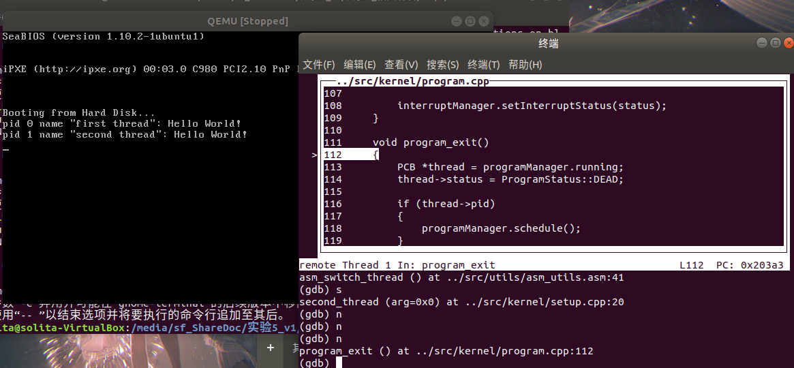

# Assignment 1

## 1.1 使用宏定义的好处

在开始实验前我先补充一些个人思考。

在实验报告中，对于可变参数的相关函数，题中使用了**宏**定义。

```c
#ifndef STDARG_H
#define STDARG_H

typedef char *va_list;
#define _INTSIZEOF(n) ((sizeof(n) + sizeof(int) - 1) & ~(sizeof(int) - 1))
#define va_start(ap, v) (ap = (va_list)&v + _INTSIZEOF(v))
#define va_arg(ap, type) (*(type *)((ap += _INTSIZEOF(type)) - _INTSIZEOF(type)))
#define va_end(ap) (ap = (va_list)0)

#endif
```

我们在平常写小体量代码时很少使用宏定义，因此我花了些时间思考宏定义的优点。

- **使代码逻辑更清晰**

  宏，本质上，就是一段代码替换。

  比如取一个宏做例子。

  ```c
  #define _INTSIZEOF(n) ((sizeof(n) + sizeof(int) - 1) & ~(sizeof(int) - 1))
  ```

  当我们在代码中这么用时

  ```c
  char b = 'f';
  int a = _INTSIZEOF(b);
  ```

  经过编译器之后，这个代码就变成了这个样子。

  ```c
  char b = 'f';
  int a = ((sizeof(b) + sizeof(int) - 1) & ~(sizeof(int) - 1));
  ```

  这个用法看着和函数非常相似。那么宏相比函数有什么优越性呢？

- **改变变量更加方便**

  在使用函数时，为了达到在函数里修改变量的效果，一般都要传指针进去。

  在c++中，出现了`&`这个符号，传参相对更加方便。

  这么做是为了保护变量不改变。但是缺点是很容易搞混乱。

  **宏的优点正在于，因为是直接替换代码，因此变量修改不会有任何保护。也就不用绕路子写代码。**

  具体说来，看一下这个宏。

  ```c
  #define va_arg(ap, type) (*(type *)((ap += _INTSIZEOF(type)) - _INTSIZEOF(type)))
  ```

  - 这个宏用于获取可变参数列表中的下一个参数值。`ap` 是指向参数列表的指针，`type` 是参数的类型。
  - 它先将 `ap` 指针按照参数 `type` 的大小向后移动，然后再减去 `type` 的大小，这样就得到了当前参数的地址，然后将这个地址转换成 `type` 类型的指针，并通过 `*` 运算符获取该地址处的值。

  `ap`是直接发生修改了。如果要用函数写的话，就得传`ap`指针的指针进去了，麻烦不少。

宏的使用能让代码变得更可读，且逻辑更简单清晰，不会像使用函数这样复杂。

**因为宏的保护性不足，因此宏定义一般都很短。目的只是为了减少重复代码。**

## 1.2 完善printf函数

### 1.2.1 改正原来printf函数中不规范代码

在原来的`printf`代码中，有一段这样的`case`。

```c
case 'd':
case 'x':
    int temp = va_arg(ap, int);

    if (temp < 0 && fmt[i] == 'd')
    {
        counter += printf_add_to_buffer(buffer, '-', idx, BUF_LEN);
        temp = -temp;
    }

    temp = itos(number, temp, (fmt[i] == 'd' ? 10 : 16));

    for (int j = temp - 1; j >= 0; --j)
    {
        counter += printf_add_to_buffer(buffer, number[j], idx, BUF_LEN);
    }
    break;
```

这个代码有一处不规范的地方。

```c
int temp = va_arg(ap, int);
```

`temp`作为一个暂时性地变量，我们必须保证，在我们不再使用这个变量时，这个变量就释放掉。

因为很有可能，我们在后面会要再用到`temp`，但是我们忘记自己声明过了，从而报错。


然而不仅如此，这段代码是在`switch`代码段里的。这就会出现一个更大的问题：

如果我在接下来的cases要用到temp变量

- 如果我声明，编译器报错重复声明。
- 如果我不声明，**temp是在case x中声明的，这意味着，如果不执行x，temp就不存在。如果执行x，那么我要执行我的case时就必须先执行x，直到声明完temp直接跳到我的case中执行。**这在c里面也是不被允许的。


这个错误被称为**跨作用域错误**。

修改这个代码也不难，**只要给case x用大括号划定一个作用域，编译器就会在执行完这段作用域后自动释放掉temp。**

用大括号划定作用域是使用暂时性变量的良好手段。

修改后的代码如下：

```cpp
case 'd':
case 'x':{
    int temp = va_arg(ap, int);

    if (temp < 0 && fmt[i] == 'd')
    {
        counter += printf_add_to_buffer(buffer, '-', idx, BUF_LEN);
        temp = -temp;
    }

    itos(number, temp, (fmt[i] == 'd' ? 10 : 16));

    for (int j = 0; number[j]; ++j)
    {
        counter += printf_add_to_buffer(buffer, number[j], idx, BUF_LEN);
    }
    break;
}
```

### 1.2.2 添加八进制数输出功能

写法如同十进制数和十六进制数的输出。因为已经完成了大部分的功能，因此代码逻辑非常清晰。

这个八进制数并不能输出负数。

只要在原来的`printf`函数段中的`switch`语句段中添加多一个case即可。注意暂时性变量的作用域。

```cpp
case 'o':{
    int temp = va_arg(ap, int);
    itos(number, temp, 8);
    for(int j=0; number[j]; ++j){
        counter += printf_add_to_buffer(buffer, number[j], idx, BUF_LEN);
    }
    break;
}
```

在主函数中我们添加如下测试代码。

```cpp
printf("SoliTa_Test: \"Original->10  Octal-> %o\"", 10);
```

这一个代码我们期望输出`SoliTa_Test: "Original->10  Octal-> 12"`。

最后运行代码即可。为了方便测试，我将`makefile`中的`run`部分做了一些修改。

```makefile
run:
	make
	qemu-system-i386 -hda $(RUNDIR)/hd.img -serial null -parallel stdio -no-reboot
```

这样我们只要打开`makefile`所在位置的终端，输入一句就能把编译和运行搞定。

```bash
make run
```

最后虚拟机截图如下。


可以看到结果很好地执行了。

# Assignment 2

## 2.1 使用enum的好处

`enum`作为枚举类型，其本质不过是一串标识，功能可以用一个`int`类型变量来替代。

使用`enum`最大的好处是代码变得直观可读。这种写法在一个需要多人接手的大项目中很有作用。

## 2.2 自行实现PCB

我添加了一个优先级，这个优先级是一个数字，能够反映这个进程的重要程度。

```cpp
int priority;
```

为了反映这个优先级，我修改了一下程序，给出三个线程。

```cpp
void third_thread(void *arg) {
    printf("PRIORITY--%d--pid %d name \"%s\": Hello World!\n",programManager.running->priority, programManager.running->pid, programManager.running->name);
    
}
void second_thread(void *arg) {
    printf("PRIORITY--%d--pid %d name \"%s\": Hello World!\n",programManager.running->priority, programManager.running->pid, programManager.running->name);
}

void first_thread(void *arg)
{
    // 第1个线程不可以返回
    printf("PRIORITY--%d--pid %d name \"%s\": Hello World!\n",programManager.running->priority, programManager.running->pid, programManager.running->name);
    if (!programManager.running->pid)
    {
        programManager.executeThread(second_thread, nullptr, "second thread", 2);
        programManager.executeThread(third_thread, nullptr, "third thread", 2);
    }
    asm_halt();
}
```

除此以外，为了反映出0进程以外的所有进程都运行完了，我适当修改了`ProgramManager`的代码，加入了一个判断条件。

```cpp
List allPrograms;   // 所有状态的线程/进程的队列
List readyPrograms; // 处于ready(就绪态)的线程/进程的队列
PCB *running;       // 当前执行的线程
int ProgramManagerflag; // 决定要不要打印停止命令
```

对`schedule`的`if (readyPrograms.size() == 0)`部分做适当补充。

```cpp
if (readyPrograms.size() == 0)
{
    interruptManager.setInterruptStatus(status);
    if(ProgramManagerflag == 0){
        printf("All thread (without pid 0) has been finished. System is sleep...\n");
        ProgramManagerflag = 1;
    } 
    return;
}
```

最后我们运行程序观察一下是否有打印出我们新添加的优先级。


可以看到程序很好的运行了。

# Assignment 3

## 3.1 运行原理

在系统进入保护模式之后，整个程序的运行流程如下。


代码中实现的是时间片轮转算法。因此，触发中断后会运行一次中断处理函数。整个切换是这样执行的。


**整个中断执行的流程是自动的。因此，我们不能只追踪setup_kernel函数，我们还得追踪schedule函数才能理解整个进程切换。**

而中断处理函数是用来进行进程切换的。因此我们添加一个打印函数，指示进程切换的时间，方便调试。

```cpp
// ProgramManager::schedule()中添加
printf("pid %d is stop, and pid %d is continue...\n", cur->pid, next->pid);
```

然后我们在`setup_kernel`新添加两个进程，分别放在进程一中。

```cpp
void third_thread(void *arg) {
    printf("pid %d name \"%s\": Hello World!\n", programManager.running->pid, programManager.running->name);
    while(1) {
        
    }
}
void second_thread(void *arg) {
    printf("pid %d name \"%s\": Hello World!\n", programManager.running->pid, programManager.running->name);
}

void first_thread(void *arg)
{
    // 第1个线程不可以返回
    printf("pid %d name \"%s\": Hello World!\n", programManager.running->pid, programManager.running->name);
    if (!programManager.running->pid)
    {
        programManager.executeThread(second_thread, nullptr, "second thread", 1);
        programManager.executeThread(third_thread, nullptr, "third thread", 1);
    }
    asm_halt();
}
```

## 3.2 追踪setup_kernel()

接下来我们追踪`setup`函数。

将`gdbinit`改成如下形式。

```bash
target remote:1234
file ../build/kernel.o
set disassembly-flavor intel
b setup_kernel
c
```

在终端中打开debug。

```bash
make debug
```

启动的界面如下。


我们一直运行函数到倒数第二行，会发现，屏幕没有任何输出。


再运行一步可以看到如下输出。


可以看到，进程现在的切换为：进程1已经执行完毕，内存被释放了，只剩下进程0（不可释放）和进程2（里面写了无限循环函数）在不断切换。

这说明一件事：中断的产生是硬件产生的，我们没办法只追踪setup_kernel了解运作全貌。

## 3.3 追踪c_time_interrupt_handler()

我们修改`gdbinit`成如下代码。

```bash
target remote:1234
file ../build/kernel.o
set disassembly-flavor intel
b c_time_interrupt_handler
c
```

进入debug。因为我们追踪的是中断处理函数，因此进入这个函数时一定发生了中断。


可以看到，中断第一次发生的时候，进程一已经创建好了。在本次实验代码中，我们设定过十次才切换一次代码。

我们打好断点，不断继续运行，直到运行到分支判断中。


进入函数。进行到这一步时

```cpp
asm_switch_thread(cur, next);  //断点位置
printf("pid %d is stop, and pid %d is continue...\n", cur->pid, next->pid);
```

再进行一步，发现函数没有进行下去，而是直接跳到了第二次中断（没有打印切换函数）此时的输出结果如下。


为了搞清楚这一步发生了什么，我们重新追踪，并且进入`asm_switch_thread()`函数，运行到末尾，开始观察。


再运行一步，我们发现运行到了第二个函数中。这意味着线程切换成功。


运行完这个函数之后，我们发现，运行直接跳转到了终止函数里。



这是怎么做到的？

这个设计非常巧妙。

### 3.3.1 从进程跳转到终止函数的原理

我们已经知道x86芯片对栈是从高地址向低地址延展的。

而`ret`命令，根本上是栈指针往后退一位，然后读取内存中存储的地址，再跳转到对应的地址。

每一个c语言函数运行完之后，转化为汇编语言，最后都有一个`ret`指令。

然后我们回想一下，当初我们创建线程的时候，我们压了什么东西进栈里？

```cpp
thread->stack = (int *)((int)thread + PCB_SIZE);
thread->stack -= 7;
thread->stack[0] = 0;
thread->stack[1] = 0;
thread->stack[2] = 0;
thread->stack[3] = 0;
thread->stack[4] = (int)function;
thread->stack[5] = (int)program_exit;
thread->stack[6] = (int)parameter;
```

没错，在函数后面的，就是终止函数`program_exit`！

因此我们在运行完function之后就会自动跳转到终止函数里。

### 3.3.2 继续追踪

终止函数中，我们设计如下：先把进程状态设置成`DEAD`，如果监测到该进程可以返回，就重新进入`schedule`函数中运行。

因此，运行终止函数之后，我们又进入了`schedule`函数中。


这个函数里集成了释放内存的操作。

至此，线程1就被彻底杀死了，链表中这个线程被剔除掉，只剩下了线程0和线程2。

可以知道，此时的时钟中断还没到来，因为我们还没有再次触发进入中断的函数。

之后，和上面的流程一样，线程2接管，但是线程2是一个无线循环。


进行到这一步就定死在这里，正在等待时钟中断。

不断运行下去，就等到了时钟中断。

**这里其实反映了代码里存在的一个严重的逻辑问题。可以思考一下，这个看似正常运行的代码有什么隐患？我会在这一节的最后说明。**


**这就是为什么最后那个切换进程没有打印出来。因为函数最后进到了线程2，线程2进入了死循环（即一直运行不退出），直到下一次中断的到来，直接从头开始进行中断流程。**

再次运行到asm_switch_thread()，再缓步运行下去，我们发现，程序运行到了下一步。也就是说，`ret`指令返回到的地址就是打印函数的地方。


可是，为什么这次就会返回到下一条指令呢？

### 3.3.2 能够执行完中断函数的原理

这个命令，是从线程2切换到线程0。

因此理应来说，函数返回之后，应该是跳到线程0中继续运行才对。

**但是我们思考一下，当时线程0被换下去的时候，保存在栈里的东西到底是什么？** 


观察这个图，我们知道：

- 返回函数时，首先esp会把栈里的四个寄存器的值读进来。
- 然后`ret`再指令读return value，得到下一条指令的运行值。

因此，无论是第一次创建的进程，还是被中断的进程，都是靠栈顶的第五个元素来判断。

问题来了，**线程0被换下来的时候，程序运行到哪里了？**

这就是整个设计最巧妙（**但也是最疑惑的地方，因为这个设计造成了上述提到的严重的逻辑错误**）的地方。

- 首次执行时，我们切换进程的时候，**进入汇编函数时，编译器帮我们把最后执行的那一个指令的地址压进的栈。**
- **那一条指令正好就是`asm_switch_thread`**
- 因此，下一次再载入这个函数的时候，**这个进程直接从下一条指令开始运行。**

因此就能达到直接从下一条指令开始运行。

**但是这个处理方法逻辑是很奇怪的。**

- 第一点，这意味着，我们首次建立进程的时候，**中断函数没有执行完就被打断了。**我马上就会阐明这一点的危害性。
- 第二点，这是否意味着，不仅是首次，每次**进程被奇数次调用时，中断都是被打断的？**我们马上就会来验证这一点。

这两点的存在，让整个代码的正确性得不到保证。

### 3.3.4 示例代码中存在的严重逻辑问题

#### 3.3.4.1 时钟中断没有被屏蔽

回到3.3.2中的疑问。代码中存在什么问题吗？

也许你已经发现了。**首次创建进程2的时候，程序从中断一路执行到进程2的无限循环。但是中间没有任何代码打开了中断。**

这意味着，从原则上来说，**因为中断被禁止，进程2本来是不可能被切换出去的。**

**但是实验结果就是切换出去了。**

这有严重的矛盾。唯一的解释是，**CLI指令没有关闭时钟中断。**

我重写了关中断的代码，为了验证是否是在关闭中断之后仍然响应了中断。最后我通过debug指令得到了如下的截图。


符合我的猜想，**程序的关中断没有影响时钟中断。即使已经关掉了中断，中断还是发生了。**

虚拟机的时钟信号很长，因此这样的中断不影响代码正常运行。

**但是如果程序的原子指令足够长，那么此时的时钟中断会直接切断原子指令的运行，可能造成程序崩溃。**

但是实验给我的程序有一个搞笑的地方：这个程序是建立在这个错误上才能运行的...如果我把时钟中断也给关了，那么线程调度就卡死了...

一种可行的解决方法是这样的：

- 在调度函数中把时钟中断也给关掉
- 然后在每一个线程最开始再把时钟中断打开

#### 3.3.4.2 中断函数被打断

第一个问题说明中断没有被屏蔽。

那么，这说明，进程刚被创建的时候，**中断函数是被打断的。**

这意味着，压入栈的值，**不是这个函数运行到的地方，而是当时中断函数被打断的地方！**

然后之后的每次线程中断调度都是**从中断被打断的地方开始运行到程序->从程序被打断的地方开始运行中断程序然后中断被打断**。这样来回往复运行。

这显然和我们的设计不符，只是因为很凑巧，这个函数没有造成大问题罢了。

我们来修改原程序的代码来观察这一点。为了观察中断开始和中断结束，我们在schedule部分加上打印语句。

```cpp
extern "C" void c_time_interrupt_handler()
{
    PCB *cur = programManager.running;

    if (cur->ticks)
    {
        --cur->ticks;
        ++cur->ticksPassedBy;
    }
    else
    {
        printf("SCHEDULE-Interrupt is START.\n");
        programManager.schedule();
        printf("SCHEDULE-Interrupt is END.\n");
    }
}
```

这样我们就能观察，时间片用完之后，中断到底执行完没有。

如果START的数量和END的数量是相同的，说明每一次中断都执行完了，反之，就说明有问题。

使用debug模式在中断函数打上断点，运行十次结果如下。


问题已经很明显了：**只有一次START，但是没有END。说明中断真的被打断了。**


再运行十次，我们发现：**START了两次，才有了一次END。根据我们前面的推理，这是0号线程的中断按顺序执行完了。这意味着，相邻的START和END是匹配不上的。**

多运行几次结果如下。


无论怎么运行，START的数量永远比END多。这意味着，永远有一个中断处于被打断状态。这不是我们想要的结果。

其危害性在于，**上一个问题我们提到时钟中断没法被关闭，这个问题已经很严重了。**

**但是在这里问题将变得更加严重。**

#### 3.3.4.3 中断永远被关闭 

**仔细思考一下，如果一个中断没有被执行完，根据示例程序里线程管理程序的写法，是不是意味着，中断在此期间是一直关闭的？**

（因为在程序中，关中断是直接CLI关闭的，但是恢复是靠一个变量state，存储着关闭前的状态，如果关闭之前是CLOSE（比如说，如果之前有一个中断是被打断的），那么即使这个中断运行完了，那么恢复之后的结果仍然是CLOSE。）

**如果一直有一个中断被打断，就意味着，中断永远没有办法被打开！**

要验证这一点也很简单。我们在`schedule`函数的最后添加如下代码。

```cpp
if(status == false) printf("Interrupt is still CLOSE.\n");
if(status == true) printf("Interrupt has been OPEN.\n");
```

理应来说，如果中断都是正常运行的，那么在这个函数运行完毕之后，中断理应是打开的。

也就是一定都是OPEN才对。因为程序中没有对中断函数嵌套调用。

但是我们的运行结果是这样的。


**中断全部都是CLOSE。中断从来没有被打开过。**

**一方面，时钟中断一直没有被关闭。另一方面，CLI关闭的那些中断永远没有办法被打开。**

问题变得非常严重。

要彻底改正这个问题需要重写中断程序，工作量不小。

# Assignment 4

本次实验实现先进先出算法。

## 4.1 代码原理与展示

算法不需要使用时钟中断，因此我们把中断函数内容清空。

```cpp
extern "C" void c_time_interrupt_handler()
{
}
```

先进先出算法核心是运行完之后才轮到下一个进程。因此我们只要在每一个进程后面跟一个修改过的`schedule`函数即可。

`schedule`函数的实现如下。

```cpp
void ProgramManager::schedule_2()
{
    bool status = interruptManager.getInterruptStatus();
    interruptManager.disableInterrupt();
    
    if(readyPrograms.size() == 0){
        printf("All thread has been finished. System is sleep...\n");
        asm_halt();
    }

    if (running->status == ProgramStatus::DEAD)
    {
        releasePCB(running);
    }

    ListItem *item = readyPrograms.front();
    PCB *next = ListItem2PCB(item, tagInGeneralList);
    PCB *cur = running;
    next->status = ProgramStatus::RUNNING;
    running = next;
    readyPrograms.pop_front();

    asm_switch_thread(cur, next);
    printf("pid %d is finished, and pid %d is loaded and start to run.\n", cur->pid, next->pid);


    interruptManager.setInterruptStatus(status);
    
}
```

这个算法把`if(readyPrograms.size() == 0)`调至最前，而且直接用`asm_halt()`堵死，正是为了让最后一个进程执行完之后就不再继续运行，防止后面的列表操作出现异常。

## 4.2 示例运行

我们使用如下的示例进程运行。

```cpp
void third_thread(void *arg) {
    printf("PRIORITY--%d--pid %d name \"%s\": Hello World!\n",programManager.running->priority, programManager.running->pid, programManager.running->name);
    programManager.schedule_2();
}
void second_thread(void *arg) {
    printf("PRIORITY--%d--pid %d name \"%s\": Hello World!\n",programManager.running->priority, programManager.running->pid, programManager.running->name);
    programManager.schedule_2();
}

void first_thread(void *arg)
{
    // 第1个线程不可以返回
    printf("PRIORITY--%d--pid %d name \"%s\": Hello World!\n",programManager.running->priority, programManager.running->pid, programManager.running->name);
    if (!programManager.running->pid)
    {
        programManager.executeThread(second_thread, nullptr, "second thread", 2);
        programManager.executeThread(third_thread, nullptr, "third thread", 2);
    }
    programManager.schedule_2();
}
```

此时，进程是线性存在的，因此第0个进程直接消除了也是可以的。

运行结果如下。


可以看到，程序执行了下来。

如果我们把第二个进程设置成永不退出，即

```cpp
void second_thread(void *arg) {
    printf("PRIORITY--%d--pid %d name \"%s\": Hello World!\n",programManager.running->priority, programManager.running->pid, programManager.running->name);
    while(1){};
    programManager.schedule_2();
}
```

程序最后运行的结果如下。


进程会卡在第二个线程不动了。这也符合我们FIFO的期望，中断并没有干扰程序运行。

## 4.3 一点碎碎念

我们此时如果在每个进程结束前检查中断情况，即

```cpp
void third_thread(void *arg) {
    printf("PRIORITY--%d--pid %d name \"%s\": Hello World!\n",programManager.running->priority, programManager.running->pid, programManager.running->name);
    if(interruptManager.getInterruptStatus() == true) printf("interrupt is open.\n");
    else printf("interrupt still close...");
    programManager.schedule_2();
}
void second_thread(void *arg) {
    printf("PRIORITY--%d--pid %d name \"%s\": Hello World!\n",programManager.running->priority, programManager.running->pid, programManager.running->name);
    if(interruptManager.getInterruptStatus() == true) printf("interrupt is open.\n");
    else printf("interrupt still close...");

    
    programManager.schedule_2();
    
}

void first_thread(void *arg)
{
    // 第1个线程不可以返回
    printf("PRIORITY--%d--pid %d name \"%s\": Hello World!\n",programManager.running->priority, programManager.running->pid, programManager.running->name);
    if (!programManager.running->pid)
    {
        programManager.executeThread(second_thread, nullptr, "second thread", 2);
        programManager.executeThread(third_thread, nullptr, "third thread", 2);
    }
    if(interruptManager.getInterruptStatus() == true) printf("interrupt is open.\n");
    else printf("interrupt still close...");
    programManager.schedule_2();
}
```

得到的结果是这样的。


所有的中断都是打开的，这符合我们的期待。

说明演示代码里提供的时间片流转算法是真的有问题...
