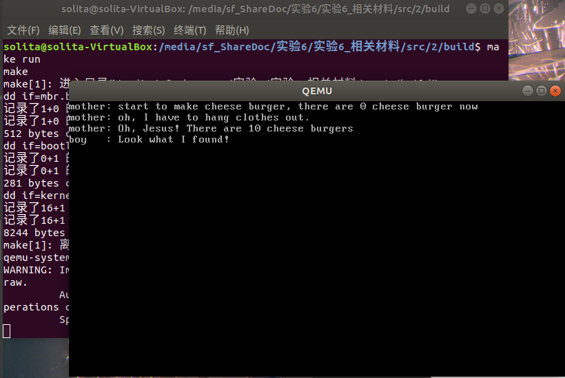
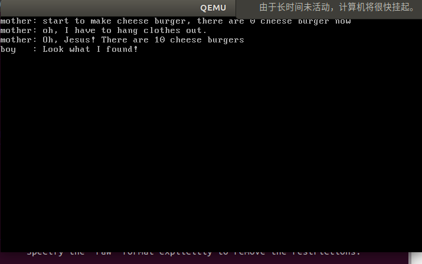
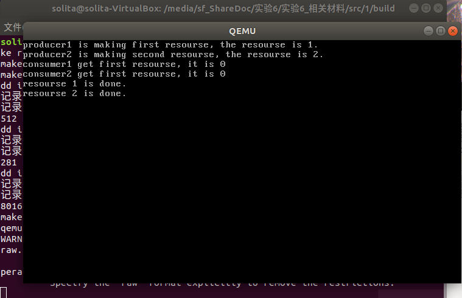
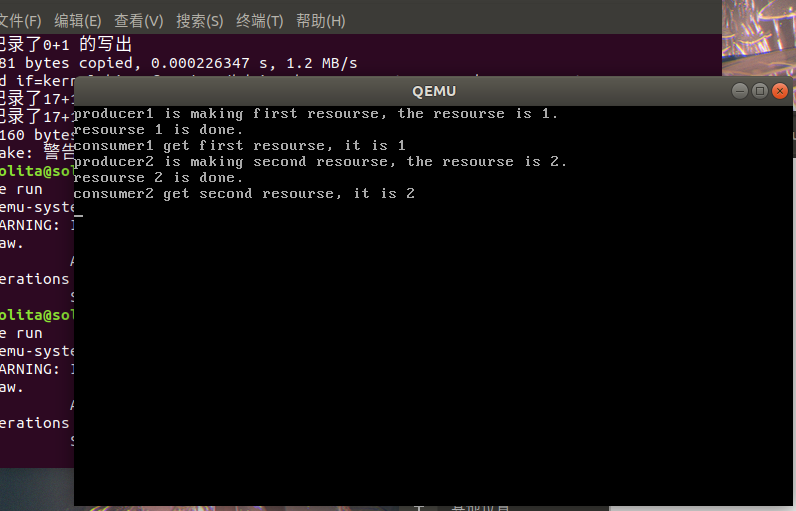
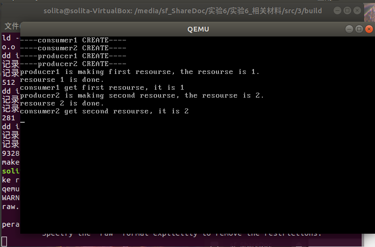
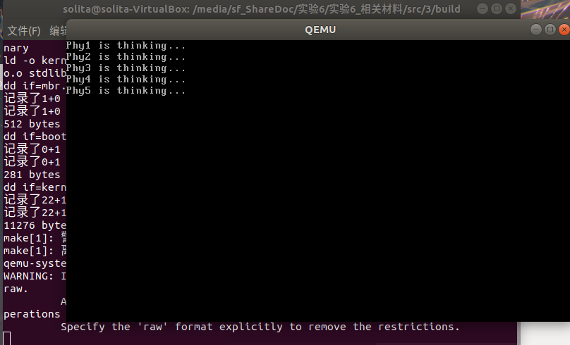
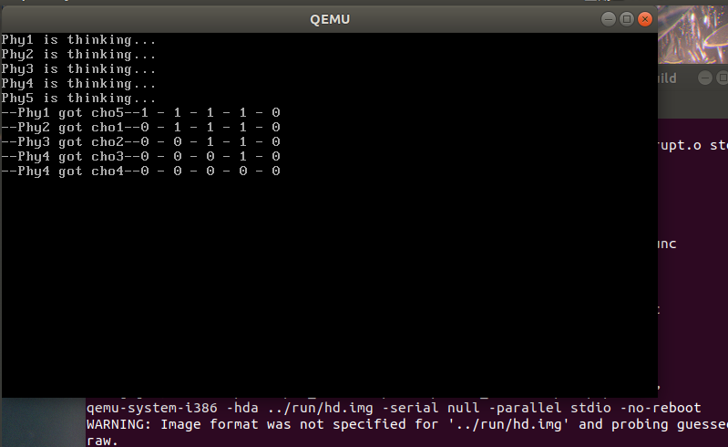
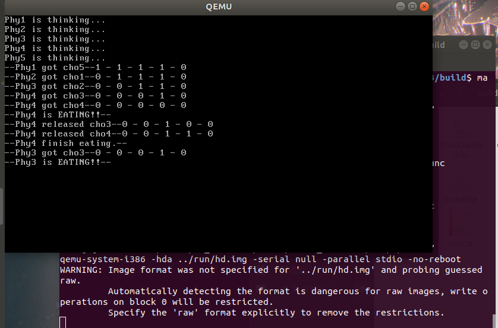
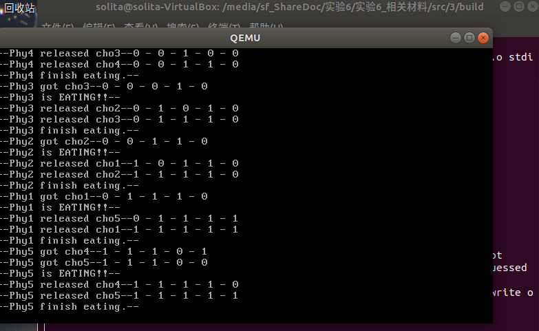

# Assignment 1

## 1.1 代码复现

我会基于“消失的芝士汉堡”这个问题阐述锁的思路。

芝士汉堡问题只有两个进程，因此信号量问题其实会退化成自旋锁问题。

### 1.1.1 自旋锁

自旋锁的根本目的是为了**让一个进程不要因为中断，让另一个进程改变了这个进程需要用的值。**

因此一个自旋锁的用法应该如下。

```cpp
void thread(void*){
	//可以被打断的部分
    locK();
    //不可被打断的部分
    unlock();
}
```

我们这次不用关中断的方法来实现，而是用**忙等待**来实现自旋锁。

因此很自然我们需要一个全局变量，这个变量被改为1之后其他想进入临界区进程不得运行。

我们还需要一个局部变量，这个局部变量为0的进程允许进入临界区。

**这里就要求必须保证这些局部变量中只有一个局部变量为0，否则就会出现冲突。**

思路是较为简单的。

```cpp
void SpinLock::lock()
{
    uint32 key = 1;

    do
    {
        asm_atomic_exchange(&key, &bolt);
        //printf("pid: %d\n", programManager.running->pid);
    } while (key);
}
```

```asm
asm_atomic_exchange:
    push ebp
    mov ebp, esp
    pushad

    mov ebx, [ebp + 4 * 2] ; register
    mov eax, [ebx]         ; 
    mov ebx, [ebp + 4 * 3] ; memory
    xchg [ebx], eax        ;
    mov ebx, [ebp + 4 * 2] ; memory
    mov [ebx], eax         ; 

    popad
    pop ebp
    ret
```

解除自旋锁一句代码就能解决。

```cpp
void SpinLock::unlock()
{
    bolt = 0;
}
```

**但是上述的自旋锁是一个有条件的原子操作。**在实际使用中，这种操作是原子的，在实验指导中指明了这种绝对性。

在1.2中我将这种自旋锁改正成了真正的原子操作，且也不是靠`LOCK`实现的，时间上不会有损耗。

我们键入这两个进程。

```cpp
void a_mother(void *arg)
{
    aLock.lock2();
    int delay = 0;

    printf("mother: start to make cheese burger, there are %d cheese burger now\n", cheese_burger);
    // make 10 cheese_burger
    cheese_burger += 10;

    printf("mother: oh, I have to hang clothes out.\n");
    // hanging clothes out
    delay = 0xfffffff;
    while (delay)
        --delay;
    // done

    printf("mother: Oh, Jesus! There are %d cheese burgers\n", cheese_burger);
    aLock.unlock();
}

void a_naughty_boy(void *arg)
{
    aLock.lock2();
    printf("boy   : Look what I found!\n");
    // eat all cheese_burgers out secretly
    cheese_burger -= 10;
    // run away as fast as possible
    aLock.unlock();
}
```

如果没有自旋锁，最终结果会是`a_naughty_boy`进程会先执行完，最后打印出来的汉堡数量会是0。

但是加入自旋锁之后结果变成如下。



自旋锁起了作用。

### 1.1.2 信号量

我们有了自旋锁之后，就能保证很多操作都可以是原子操作了。

这样我们就能实现更为复杂的信号量。

信号量相比自旋锁最有优势的地方在于其能够分配多个资源。

- 没有资源时进程可以压进`BLOCK`阻塞队列中。
- 虽然只有一个CPU，但是`RUN`可以和`READY`不断换进换出，实现时间片流转算法。
- 有资源时，就可以把阻塞进程压进`READY`队列中参与时间片轮转算法。

因此，P操作和V操作不是单纯的锁和放的过程，我们还要对五个状态队列做维护。

```cpp
void Semaphore::P()
{
    PCB *cur = nullptr;

    while (true)
    {
        semLock.lock();
        if (counter > 0)
        {
            --counter;
            semLock.unlock();
            return;
        }

        cur = programManager.running;
        waiting.push_back(&(cur->tagInGeneralList));
        cur->status = ProgramStatus::BLOCKED;

        semLock.unlock();
        programManager.schedule();
    }
}
```

```cpp
void Semaphore::V()
{
    semLock.lock();
    ++counter;
    if (waiting.size())
    {
        PCB *program = ListItem2PCB(waiting.front(), tagInGeneralList);
        waiting.pop_front();
        semLock.unlock();
        programManager.MESA_WakeUp(program);
    }
    else
    {
        semLock.unlock();
    }
}
```

在芝士汉堡问题中，信号量问题退化成为自旋锁问题。因此我们可以简单的将`lock()`和`unlock()`替换成`PV`操作。结果和上面的截图是一样的。

## 1.2 改进自旋锁

原本的实现方法中，锁进程的函数是一个“伪”原子操作。

这种伪原子操作的根本原因在于，**key值发生更改之后，没有办法阻止其他进程也修改自身的key值。**

因此，改进的思路就在于，**保证bolt值改变在key前面，并且把bolt值判断跳转放在key修改之前。**这样就能保证，即使锁的过程被打断，一旦bolt值改为1，那么其他进程没有办法绕过bolt值判断修改key值，只有原进程才能修改自己的key值。

但是，bolt值的判断要尽可能最短，越简单的操作越好验证操作是否为原子操作，最好是一步搞定。

**`bts`指令就是这样一个符合我们期望的指令。**

- `bts`的作用是：检查一个位是不是为1。
  - 如果是1，CF位置1，原位不改变。
  - 如果是0，CF位置0，原位被改变为1。
- `bts`可以对内存直接操作
  - 前面的自旋锁中，出现冲突的原因还是因为没有办法直接将两个内存的内容进行置换。这个指令能直接操作内存且是靠硬件实现的，这样我们就能**真正意义上的原子操作修改bolt值。**

新的自旋锁的代码如下。

```asm
asm_atomic_ex2:
    push ebp
    mov ebp, esp
    pushad

    mov ebx, [ebp + 4 * 3]
    bts dword [ebx], 0
    jc asm_atomic_ex2_exit
    mov ebx, [ebp + 4 * 2]
    mov dword [ebx], 0
    
asm_atomic_ex2_exit:
    popad
    pop ebp
    ret
```

- `bts`指令之前，是把bolt值放进`ebx`中，**最关键的修改操作是原子的，可以保证无论怎么打断都不会出现其他进程可以修改自己的key值。**
- 之后就是修改key值。

这样的代码就是**真正意义上的原子操作。且不是靠禁用中断实现的，而是靠逻辑实现。**

我们修改一下lock函数调用的代码，从`asm_atomic_exchange`改为`asm_atomic_ex2`，把该补上的声明和头文件语句都加上。

最后执行代码结果如下。



可以看到，运行的结果并没有发生改变。这个自旋锁是可行的。

# Assignment 2

## 2.1 一个生产者-消费者问题

我们考虑这样一个问题：

- 有两个生产者，有两个消费者，但是只有一个放资源的位置。
- 创建进程时，先创建两个生产者，再创建两个消费者。
- 要求运行时流程如下：
  - 一号生产者先花不止一个时间片的时间产生一个资源1。
  - 一号消费者取出其产生的资源。（取出0代表取出失败）
  - 二号生产者在一号生产者产生完资源，且一号消费者取出资源之后再产生一个资源2。
  - 二号消费者取出其产生的资源。取出资源的消费者没有要求，但是要求资源是按照1,2的顺序被取出来的。

## 2.2 不使用信号量的结果

根据上述要求，如果我们不考虑锁的话，写成的代码应该是这样的。

```cpp
void consumer1(void *arg){
    printf("consumer1 get first resourse, it is %d\n", resourceList);
}

void consumer2(void *arg){
    printf("consumer2 get first resourse, it is %d\n", resourceList);
}

void producer1(void *arg){
    int delay = 0;
    printf("producer1 is making first resourse, the resourse is 1.\n");
    // hanging clothes out
    delay = 0xfffffff;
    while (delay)
        --delay;
    resourceList = 1;
    printf("resourse 1 is done.\n");
}

void producer2(void *arg){
    int delay = 0;
    printf("producer2 is making second resourse, the resourse is 2.\n");
    delay = 0xfffffff;
    while (delay)
        --delay;
    resourceList = 2;
    printf("resourse 2 is done.\n");
}
```

在第一个线程中调用的顺序按照题目要求如下。

```cpp
void first_thread(void *arg)
{
    // 第1个线程不可以返回
    stdio.moveCursor(0);
    for (int i = 0; i < 25 * 80; ++i)
    {
        stdio.print(' ');
    }
    stdio.moveCursor(0);

    cheese_burger = 0;
    
    programManager.executeThread(producer1, nullptr, "second thread", 1);
    programManager.executeThread(producer2, nullptr, "second thread", 1);
    programManager.executeThread(consumer1, nullptr, "third thread", 1);
    programManager.executeThread(consumer2, nullptr, "third thread", 1);

    asm_halt();
}
```

我们直接执行代码的话，会发现得到如下结果。



我们发现

- 第一个生产者还没生产完第二个消费者就继续生产了。
- 第一个消费者和第二个消费者都在生成资源时尝试取出资源，都取出失败。

这显然是不合理的。

## 2.3 使用信号量的结果

为了避免这样的情况出现，我们引入两个信号量。

- `NumberOfPlace`：空位剩余的数量。
- `NumberOfRes`：产生资源的数量。

我们给生产者限定如下：

- 检查是否有空位，有空位才进入生产。
- 生产结束之后，资源数量加一，在资源被取出之前不让出空位。

我们给消费者限定如下：

- 检查是否有资源，有资源才取出资源。
- 让生产这个资源的生产者让出空位，即空位加一。

根据定义，我们知道，最开始空位为1，资源为0。因此初始化如下。

```cpp
NumberOfPlace.initialize(1);
NumberOfRes.initialize(0);
```

将四个生产者的代码更改如下。

```cpp
void consumer1(void *arg){
    NumberOfRes.P();
    printf("consumer1 get first resourse, it is %d\n", resourceList);
    NumberOfPlace.V();
}

void consumer2(void *arg){
    NumberOfRes.P();
    printf("consumer2 get second resourse, it is %d\n", resourceList);
    NumberOfPlace.V();
}

void producer1(void *arg){
    NumberOfPlace.P();
    int delay = 0;
    printf("producer1 is making first resourse, the resourse is 1.\n");
    // hanging clothes out
    delay = 0xfffffff;
    while (delay)
        --delay;
    resourceList = 1;
    printf("resourse 1 is done.\n");
    NumberOfRes.V();
}

void producer2(void *arg){
    NumberOfPlace.P();
    int delay = 0;
    printf("producer2 is making second resourse, the resourse is 2.\n");
    delay = 0xfffffff;
    while (delay)
        --delay;
    resourceList = 2;
    printf("resourse 2 is done.\n");
    NumberOfRes.V();
}
```

最后运行的结果如下。



可以看到，程序正确的运行了。

为了检验这个程序是正确的，我们把生成消费者的过程放在前面，让消费者先运行，看看信号量此时还起不起作用。

同时我们在进程中加入打印字符串的功能。

```cpp
void first_thread(void *arg)
{
    // 第1个线程不可以返回
    stdio.moveCursor(0);
    for (int i = 0; i < 25 * 80; ++i)
    {
        stdio.print(' ');
    }
    stdio.moveCursor(0);

    cheese_burger = 0;
    NumberOfPlace.initialize(1);
    NumberOfRes.initialize(0);

    programManager.executeThread(consumer1, nullptr, "forth thread", 1);
    printf("----consumer1 CREATE----\n");
    programManager.executeThread(consumer2, nullptr, "fifth thread", 1);
    printf("----consumer2 CREATE----\n");
    programManager.executeThread(producer1, nullptr, "second thread", 1);
    printf("----producer1 CREATE----\n");
    programManager.executeThread(producer2, nullptr, "third thread", 1);
    printf("----producer2 CREATE----\n");
    

    asm_halt();
}
```

最后运行结果如下。



可以看到，即使生产者进程是在后面被调用的，消费者还是等生产者生产完之后再取出资源，生产者2还是等取出资源之后才进行。

# Assignment 3

## 3.1 使用信号量应对哲学家问题

哲学家问题中，我们给每个筷子编号的话，那么每个筷子都是一个信号量，大小为1。

我们假设每个哲学家都会取自己编号与前一个编号的正数模的筷子。

比如，哲学家一号会取五号筷子和一号筷子，哲学家二号会取一号筷子和二号筷子。

同时，哲学家思考和吃饭都要时间，因此可以加入`delay`来等待。

我们就可以根据此写代码。因为五个哲学家的代码高度雷同，因此我只给出一号哲学家的代码，其他哲学家的代码几乎完全相同。

```cpp
void Phy1(void *arg){
    int delay = 0;
    printf("Phy1 is thinking...\n");
    delay = 0xfffffff;
    while (delay)
        --delay;
    cho5.P();
    cho1.P();
    printf("--Phy1 is EATING!!--\n");
    printf("-Now Chopstic- %d - %d - %d - %d - %d\n", cho1.getCounter(), cho2.getCounter(), cho3.getCounter(), cho4.getCounter(), cho5.getCounter());
    delay = 0xfffffff;
    while (delay)
        --delay;
    cho5.V();
    cho1.V();
        printf("--Phy1 finish eating.--\n");

    printf("-Now Chopstic- %d - %d - %d - %d - %d\n", cho1.getCounter(), cho2.getCounter(), cho3.getCounter(), cho4.getCounter(), cho5.getCounter());

}
```

为了大致观察每一个哲学家进餐时的筷子数量，我写了打印函数观察。

首先，为了得到信号量的大小，我们得在类里新写一个返回信号量的函数。

```cpp
int Semaphore::getCounter(){
    return int(this->counter);
}
```

最后打印出来的结果如下。


可以看到，所有哲学家都进餐了，最后所有筷子也都归位了。但是**进餐过程中的筷子变化很有意思。我们来分析一下。**

- 看第三行筷子，也就是`phy1`进餐完毕之后的筷子数目

  本来应该是这样的。

  ```
  1 - 0 - 0 - 1 - 1
  ```

  但是最后我们发现四号位的筷子不见了。

  从后面五号哲学家进餐，可以知道，这个消失的筷子**其实是给五号哲学家拿走了。**

- 同理，第四行筷子中的第一个筷子也不翼而飞，其实是给二号哲学家拿走了。

这些哲学家在他们的进程中都拿走一个筷子，然后等待另一个筷子。

这种占着茅坑不拉屎的行为最终会导致**死锁的形成**。

## 3.2 死锁情况

根据上面的分析，要制造出死锁非常简单。

**只需要在每个哲学家取完第一个筷子之后加一个足够长的延迟，这样经过五次切换，每个哲学家都只拿到一个筷子，就会进入死锁状态。**

将每个哲学家代码更改成如下。

```cpp
void Phy1(void *arg){
    int delay = 0;
    printf("Phy1 is thinking...\n");
    delay = 0xfffffff;
    while (delay)
        --delay;
    cho5.P();
    delay = 0xfffffff;
    while (delay)
        --delay;
    cho1.P();
    printf("--Phy1 is EATING!!--\n");
    printf("-Now Chopstic- %d - %d - %d - %d - %d\n", cho1.getCounter(), cho2.getCounter(), cho3.getCounter(), cho4.getCounter(), cho5.getCounter());
    delay = 0xfffffff;
    while (delay)
        --delay;
    cho5.V();
    cho1.V();
        printf("--Phy1 finish eating.--\n");

    printf("-Now Chopstic- %d - %d - %d - %d - %d\n", cho1.getCounter(), cho2.getCounter(), cho3.getCounter(), cho4.getCounter(), cho5.getCounter());

}
```

最后运行的截图如下。



会发现运行卡在这一步了。

为了更方便观察，我们将打印函数做一些修正。

```cpp
void Phy1(void *arg){
    int delay = 0;
    printf("Phy1 is thinking...\n");
    delay = 0xfffffff;
    while (delay)
        --delay;
    cho5.P();
    printf("--Phy1 got cho5--%d - %d - %d - %d - %d\n", cho1.getCounter(), cho2.getCounter(), cho3.getCounter(), cho4.getCounter(), cho5.getCounter());
    delay = 0xfffffff;
    while (delay)
        --delay;
    cho1.P();
    printf("--Phy1 got cho1--%d - %d - %d - %d - %d\n", cho1.getCounter(), cho2.getCounter(), cho3.getCounter(), cho4.getCounter(), cho5.getCounter());
    printf("--Phy1 is EATING!!--\n");
    delay = 0xfffffff;
    while (delay)
        --delay;
    cho5.V();
    printf("--Phy1 released cho5--%d - %d - %d - %d - %d\n", cho1.getCounter(), cho2.getCounter(), cho3.getCounter(), cho4.getCounter(), cho5.getCounter());
    cho1.V();
    printf("--Phy1 released cho1--%d - %d - %d - %d - %d\n", cho1.getCounter(), cho2.getCounter(), cho3.getCounter(), cho4.getCounter(), cho5.getCounter());
        printf("--Phy1 finish eating.--\n");
}
```

最后运行的结果如下。



可以看到，每一个哲学家都只拿了一个筷子，造成了死锁。

## 3.3 解决死锁

解决死锁有一个简单的思路。

**检测到下一根筷子拿不到的话就不拿当前的筷子了。**

因为每次拿筷子都是从左手开始起手，因此只要留有筷子，一定有筷子能够利用到这根筷子。

具体说来是写一个循环，如果下一根筷子拿不到就一直卡在那里等待。

只需要一行代码。

```cpp
while(!cho1.getCounter()) {;} 
```

因此，一号哲学家的代码更正成如下。

```cpp
void Phy1(void *arg){
    int delay = 0;
    printf("Phy1 is thinking...\n");
    delay = 0xfffffff;
    while (delay)
        --delay;
    while(!cho1.getCounter()) {;}   //更正处
    cho5.P();
    printf("--Phy1 got cho5--%d - %d - %d - %d - %d\n", cho1.getCounter(), cho2.getCounter(), cho3.getCounter(), cho4.getCounter(), cho5.getCounter());
    delay = 0xfffffff;
    while (delay)
        --delay;
    cho1.P();
    printf("--Phy1 got cho1--%d - %d - %d - %d - %d\n", cho1.getCounter(), cho2.getCounter(), cho3.getCounter(), cho4.getCounter(), cho5.getCounter());
    printf("--Phy1 is EATING!!--\n");
    delay = 0xfffffff;
    while (delay)
        --delay;
    cho5.V();
    printf("--Phy1 released cho5--%d - %d - %d - %d - %d\n", cho1.getCounter(), cho2.getCounter(), cho3.getCounter(), cho4.getCounter(), cho5.getCounter());
    cho1.V();
    printf("--Phy1 released cho1--%d - %d - %d - %d - %d\n", cho1.getCounter(), cho2.getCounter(), cho3.getCounter(), cho4.getCounter(), cho5.getCounter());
        printf("--Phy1 finish eating.--\n");
}
```

对每一个进程都做这样的修改，最后运行结果如下（没有运行完）。



可以看到，在第一次流转中，五号哲学家检测到取了筷子也无法保证另一个筷子能被取到，因此放弃取筷子。

这样四号哲学家成为了唯一一个能够吃上饭的哲学家。

四号吃完之后，释放的资源又能给三号吃饭，如此往复。

等到运行结束之后结果如下。



可以看到吃饭顺序是`4-3-2-1-5`，符合我们的预期，其中五号哲学家在最后才拿到第一根筷子。

混口饭吃可真难啊。
