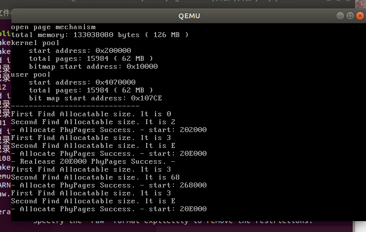

# Assignment 1

复现参考代码，实现二级分页机制，并能够在虚拟机地址空间中进行内存管理，包括内存的申请和释放等，截图并给出过程解释。

## 1.1 再述二级分页

此处主要阐述我对实验报告中二级分页的总结以及一些自己的理解。实验指导内容非常详细，但是少了一些总结性的内容，在此我给出自己的总结。

首先，二级分页的寻址如下所示。（过程由CPU自动实现）

- 传入一个地址，地址包含三个信息：页目录号，页号与业内偏移。
- 通过页目录号在页目录表查找，得到页表地址。页目录表由一个固定的寄存器存储（需要我们手动赋予它这个地址）。
- 通过对应的页表，找到内存中对应的位置，读写数据。

由此我们可知：

- 页目录表必须在操作系统启动时就初始化，并把地址放到某个寄存器中。页表不需要一次性建立，可以需要时建立。
- 在一个空间中，页目录表唯一，页表不唯一。
- 二级分页CPU自带这个功能，需要我们通过硬件操作开启，也就是汇编。

此时需要注意，内核和进程都有自己的页目录表和页表。也就是说，**页目录表和页表都是在一个块中起作用的，而不是对全局内存起作用的。**一个块内的物理地址必定是连续的。

页的根本目的是为了更高效的内存管理，希望用过表的映射将一个地址映射到一个物理内存上，从而高效地利用内存。

### 1.1.1 BitMap和二级分页

BitMap和二级分页实质上没有很大联系，但是两者作为内存管理的手段很容易混淆之间的关系，有必要阐述清楚各自的功能。

- BitMap只涉及对内存的操作，二级分页涉及到从内存和硬盘中交换页的过程。
- BitMap是监控内存每一个块是否被使用的数组，本身存贮在内存中。其起作用的时候是在系统需要给一个线程分配内存空间时。
- 二级分页是一种寻址策略，有两个数组：页目录表和页表，也都存贮在内存中。
- BitMap只有在进程需要内存时才会起作用，每一个页都是4KB（本次实验）。二级分页会涉及到虚拟内存，当一个页面需要的地址并不在物理内存上存在时（即二级页表对应的地址是无效的，就是缺页），是由缺页处理程序将二级页表中无效地址替换成有效地址。此时，这种分配空闲地址的行为就需要BitMap支持。

### 1.1.2 二级分页后的物理内存排布

经过这么多的启动，内存中的东西有点太多了。

我们需要清楚内存中内存到底有哪些东西。

要搞懂这一点，我们可以观察`boot.inc`和`os_constant.h`的内容。

根据最开始的知识，我们知道

- `0x7c00`：这是装MBR的内存起点。这个内存被装入是CPU自动实现的。
- `0x7e00`：这是BootLoader的内存起点，这是我们自己规定的。
- `0x8880`：这是中断向量表IDT的内存起点，是我们自己规定的。
- `0x20000`：这是我们内核开始的地方，这是我们自己规定的。Bootloader开保护模式之后就进入内核，在这里开始，我们写的C++程序开始发挥作用。

然后根据我们这节课的内容，我们得到一些新的内存分布。

- `0x7c00`：**此处内存在BootLoader运行时被替换成存储我们可用内存的总大小**。因为MBR（BootLoader也是）在启动之后就没有作用了，是我们自己定义的。
- `0x10000`：这是BitMap的位置，是我们自己定义的。
- `0x100000`：这是内核页目录表的位置。根据定义，我们的第一个页表在紧跟着页目录表结尾。

保护模式下提供了固定的内存区域，保存数据段、堆栈段、显存段和代码段等等。这些段所占据的内存需要根据其对应的段描述符计算出真正的开头地址。进入保护模式的那一刻，我们所有的操作都在段的保护中，包括代码。只是因为代码段刚好给我们设置成基地址从0开始，才避免了一些麻烦。

但这不代表代码就是从物理内存中的0开始的。不要忘了还有段选择子的存在。

在`0x0000 0000` 到`0x0010 0000`存放内核。

可以看到，内存中现在存储的东西确实十分复杂，需要深刻理解才能在之后的操作中不发生内存冲突的现象。

### 1.1.3 段页式内存管理的协作方法

我们同时使用段式和页式方法管理内存，自然会有一个疑问：这两个方法是怎么同时运行的？不会搞混吗？

有必要给出一个详细的段页式操作过程！

假设要访问一个内存地址，以下是详细步骤：

1. **段寄存器查找**：
   - 例如访问数据段，段选择子在 `DS` 寄存器中。
   - 段选择子找到GDT或LDT中的段描述符，假设段基地址为 `0x40000000`。
2. **段地址计算**：
   - 假设要访问的段内偏移为 `0x00003000`。
   - 线性地址 = 段基地址 + 段内偏移 = `0x40000000 + 0x00003000 = 0x40003000`。
3. **分页查找**：
   - 假设页目录基地址在CR3寄存器中为 `0x00007000`。
   - 线性地址 `0x40003000`分为：
     - 页目录索引：`0x40003000` 的高10位
     - 页表索引：中间10位
     - 页内偏移：低12位
4. **页表转换**：
   - 页目录索引在 `0x00007000` 处找到对应的页目录项（PDE）。
   - PDE指向页表基地址，页表索引找到页表项（PTE），PTE提供物理页地址。
   - 加上页内偏移得到最终物理地址。

为什么要弄得这么复杂？

- 段的根本目的是为了解决一个程序的地址定位问题。有了段之后，我们就不用担心我们写的程序开头地址不对，也不用担心不同的数据会相互混淆，数据段、代码段、堆栈段等等都分的很明确。
- 页的根本目的是为了更高效的内存管理，希望用过表的映射将一个地址映射到一个物理内存上，从而高效地利用内存。

可以看到，段最后会得到一个运算过的**虚拟地址**，然后页会把这个虚拟地址映射到**物理地址**上。

也就是，先段，后页。

使用页式管理内存时，就可以很轻松规避内存冲突的问题，因为页式管理我们已经实现绕过使用中的内存来获取空内存。

## 1.2 内存管理实现

本次内存管理时针对物理页的管理。

其实，到后面为了实现程序地址不要混乱，我们除了管理物理内存池以外，我们还需要管理虚拟内存池。虚拟内存池的作用我会在后面叙述。

现在我们先写一个进程实现内存分配。

在`src4`中提供了分配物理页的函数，我们只需要调用这些函数即可。

我们在`setup.cpp`中，第一个进程改写成如下代码。

```cpp
void first_thread(void *arg)
{
    // 第1个线程不可以返回
    // stdio.moveCursor(0);
    // for (int i = 0; i < 25 * 80; ++i)
    // {
    //     stdio.print(' ');
    // }
    // stdio.moveCursor(0);

    printf("-----------------------------\n");
    char *p1 = (char *)memoryManager.allocatePhysicalPages(AddressPoolType::KERNEL, 1);
    char *p2 = (char *)memoryManager.allocatePhysicalPages(AddressPoolType::KERNEL, 10);

    memoryManager.releasePhysicalPages(AddressPoolType::KERNEL, (int)p2, 10);
    p2 = (char *)memoryManager.allocatePhysicalPages(AddressPoolType::KERNEL, 100);


    p2 = (char *)memoryManager.allocatePhysicalPages(AddressPoolType::KERNEL, 10);

    asm_halt();
}
```

同时，我们在定义分配物理页函数的文件`address_pool.cpp`中找到对应的函数，加一些打印函数，以便观察。

最后程序结果如下。


这个程序很好地展示了功能。

- 首先，第一次分配，我们知道分配后的内存在`0x0020 0000`处。这是程序找到的第一个没有被用过的物理页的开头地址。此次分配我们设定是只分配一个页。
- 其次，第二次分配，我们观察程序发现内存在`0x0020 1000`处。可知，程序跑出来的结果是一个页的大小是`0x1000Byte`，也就是2的12次方，正好就是`4KB`，符合我们的设计。
  - 通过换算，我们知道，这应该是第`0x201`个页。
- 然后释放`p2`。
- 释放完之后我们再分配，发现内存仍在`0x0020 1000`开始，说明我们的释放是真的释放掉了。我们这次分配100个页。
- 然后我们再分配，发现这次变成了`0x 0026 5000`开始，说明中间一共有`0x64`个页被用掉了。`0x64`，刚好就是十进制数的`100`。说明分配成功。

#  Assignment 2

参照理论课上的学习的物理内存分配算法如first-fit, best-fit等实现动态分区算法等，或者自行提出自己的算法。

## 2.1 算法原理

我们这次选择`fitst-fit`算法的变体，也就是，每次申请遇到第二个符合要求的内存空间就放入。

虽然`fitst-fit`算法原理简单，但是这是一个速度最快，空间开销最小的算法。

如果使用`best-fit`等等算法，要不然每次申请时都遍历一遍空间，有很大的时间开销，要不然需要维护一个剩余空间链表，设计难度不小的同时还可能有很大的空间开销。

其实我们在Assignment 1中实现的就是`first-fit`算法。为了不重复，我把第一次符合要求改成了第二次符合要求。我称之为`second-fit`算法。

算法只要修改在`BitMap.cpp`中分配算法即可。具体说来，是设一个flag值，初始值为0，第一次适配之后换成1，第二次适配再进行内存分配。

实际代码修改如下。为了确认确实是第二次适配，我写了一些打印函数。

```cpp
int first_fit = 0;

if(empty == count && first_fit == 0){
    printf("First Find Allocatable size. It is %x\n", start);
    first_fit = 1;
    ++index;
    continue;
} 
// 存在连续的count个资源
if (empty == count && first_fit == 1)
{
    printf("Second Find Allocatable size. It is %x\n", start);
    for (int i = 0; i < count; ++i)
    {
        set(start + i, true);
    }

    return start;
}
```

## 2.2 运行结果

最后运行的结果如下。



可以看到，最后申请内存到的地方都是第二次适配才进行申请。

而且仔细观察，我们可以发现有些页在中间其实是被使用的。这也印证了物理页分配算法的正确性。

这个`second-fit`算法只是展现一种自己设计的算法防止和Assignment1重复，其本身优点不多。

# Assignment 3

参照理论课上虚拟内存管理的页面置换算法如FIFO、LRU等，实现页面置换，也可以提出自己的算法。

## 3.1 页面置换算法的目的

页面置换算法的目标是为了解决**缺页**。

缺页的产生是这样的。

**进程访问虚拟地址**：

- 进程尝试访问某个虚拟地址。此时，处理器将虚拟地址转换为相应的物理地址。

**页表查找**：

- 处理器检查页表，确定该虚拟地址是否已被映射到物理内存。如果页表项有效，则说明该虚拟页在物理内存中，处理器继续访问。

**缺页检测**：

- 如果页表项无效（即该虚拟页未被映射到物理内存），处理器会触发缺页异常，并将控制权交给操作系统内核。

因此我们要做的事情就很明了了。

**当我们发现某个地址没有分配物理页的时候，就启动页面置换算法。**

## 3.2 算法原理

本次实验实现FIFO算法。

考虑到我们并没有实现实现交换空间，也没有实现拓展空间中从磁盘读取内容交换到内存上，我们也不能直接操作CACHE。

因此我们通过实现好的虚拟页算法先手动划定三个空间，然后手动划定页号，然后根据此来实现FIFO算法。

算法的核心，是从分配好的页中找是否有符合我们需求的页。如果没有，我们就需要找到最先进来的项然后替换掉。

如何确定哪个项是最先进来的？很简单，我们初始化时所有也页都是空页，因此第一个必缺页。我们设一个整型变量`flag`，从第一个开始，每次缺页就将`flag`加一模三，就能始终将指针指在最开始的页中。

我们假设，我们有八个页要置换，这八个页的页号是`7,3,3,7,2,1,9,8`，我们假设0是空页。

最后我们实现的代码如下。我将这个程序放在了第一个进程中。

```cpp
void first_thread(void *arg)
{
    // 第1个线程不可以返回
    // stdio.moveCursor(0);
    // for (int i = 0; i < 25 * 80; ++i)
    // {
    //     stdio.print(' ');
    // }
    // stdio.moveCursor(0);

    printf("--------------------------------------\n");
    char *p1 = (char *)memoryManager.allocatePages(AddressPoolType::KERNEL, 100);
    char *p2 = (char *)memoryManager.allocatePages(AddressPoolType::KERNEL, 10);
    char *p3 = (char *)memoryManager.allocatePages(AddressPoolType::KERNEL, 100);

    printf("GOT 3 PAGES: -0x%x- -0x%x- -0x%x-\n", p1, p2, p3);

    int pagelist[8] = {7,3,3,7,2,1,9,8};
    int plist[3] = {0, 0, 0};
    int first = 0;
    int miss = 0;
    int hit = 0;
    int got = -1;
    char *pp; 

    for(int i=0; i<8; i++){
        printf("------------checking page %d...------------\n", pagelist[i]);
        int flag = 0;

        for(int j = 0; j<3; j++){
            if(plist[j] == pagelist[i]) flag = 1,got = i;
        };

        if(flag == 0){
            printf("-PAGE FAULT- ");
            plist[first] = pagelist[i];
            printf("Change. -0x%x=%d- -0x%x=%d- -0x%x=%d-\n", p1, plist[0], p2, plist[1], p3, plist[2]);
            first = (first+1)%3;
            miss++;
        }
        else{
            if(got == 0) pp = p1;
            if(got == 1) pp = p2;
            if(got == 2) pp = p3;
            printf("-HIT- the page is 0x%x\n", pp);
            hit++;
        }
    }
    printf("----------------------------\n");
    printf("FINISH. MISS=%d HIT=%d", miss, hit);
    asm_halt();
}
```

## 3.3 实现效果


观看虚拟器显示屏，可以看到流程是这样的。

1. 初始化三个页，用作FIFO模拟。
2. PAGE 7检查，缺页，替换到第1个页中。
3. PAGE 3检查，缺页，替换到第2个页中。
4. PAGE 3检查，命中，在第2个页中。
5. PAGE 7检查，命中，在第1个页中。
6. PAGE 2检查，缺页，替换到第3个页中。
7. PAGE 1检查，缺页，替换到第1个页中。
8. PAGE 9检查，缺页，替换到第2个页中。
9. PAGE 8检查，缺页，替换到第3个页中。
10. 结束，缺页6次，命中2次。

可以看到，整个流程是成功的，符合FIFO的规则。

# Assignment 4

复现“虚拟页内存管理”一节的代码，完成如下要求。

- 结合代码分析虚拟页内存分配的三步过程和虚拟页内存释放。
- 构造测试例子来分析虚拟页内存管理的实现是否存在bug。如果存在，则尝试修复并再次测试。否则，结合测例简要分析虚拟页内存管理的实现的正确性。

## 4.1 再述虚拟页分配

我在前面分析了物理页之间的关系，再述虚拟页，就方便许多。

### 4.1.1 虚拟页和物理页

物理页涉及对内存的直接操作。物理页的目的是为了更高效利用内存。

那为什么还需要虚拟页？

实验指导中说，虚拟页是因为虚拟地址到物理页之间有一个映射，这意味着我们的防止内存冲突的管理都是只针对物理页而不是针对虚拟地址的。一个程序中有很多对虚拟地址的操作，有可能虚拟地址会发生混乱。为了防止这种情况，所以才增设虚拟页。

这么说是可信的，但是我认为虚拟页有一种用途更为重要。**虚拟页可以为每一个进程提供一个从0开始且空间足够大的的虚拟页目录表**。

- 思考一下，我们的页目录表，在用户空间中可是只有一个的。如果有大量进程来参与页的使用的话，如果我们直接用物理页的话，程序能分配到的页的序号是完全不可控的，这意味着，一个程序没有办法有一个轻松的方式检查自己用了哪些页，在进程退出的时候，我们也没有办法检查程序是否释放掉了所有页才退出。

- 但如果每个进程都有一个虚拟页表的话就很简单了，只要退出的时候把页目录表和页表中所有使用过的页全部释放掉就可以了。

- 更近一步，虚拟页表就能将一部分的页映射到一个虚拟地址空间中。当页中没有这个地址的时候，我们就能将这个页从磁盘中读进来，实现内存扩张。虽然想要实现这种功能还要很多硬盘交换知识，但是这是一个正确的方向。

我们还没有实现这种扩张虚拟空间的操作。就现在实现的内容说来，虚拟页和物理页是一个简单的一一映射关系。

但是我们先需要搞清楚，虚拟页的分配是怎么样的。

- 首先分配一串连续的虚拟页。
- 对每一个虚拟页，找到一个分配好的物理页，得到一个物理地址（注意，这个物理地址其实也是“虚拟”的，只不过把这个地址直接传入CPU能识别到正确的页）。
- 计算出虚拟地址对应的页目录项，页表项。
  - 如果计算出来的页目录项是空的，需要分配一个新的页表，然后让页目录项指向这个新分配的页表。
- 我们把页表项与这个物理地址划等号。

到这一步，我们发现，其实寻址过程是从虚拟地址，到虚拟页目录表，再到虚拟页表，虚拟页表存的内容是一个物理页表存的内容，最后成功寻址。

这意味着，虚拟页寻址是一套独立的系统，只有到了最后才会把虚拟页映射到一个物理页上。**而在这次实验中，因为只实现了内核中的虚拟页分配，实验指导就是把虚拟页目录表当成了实际页目录表放在cr3中的。**

刚开始的时候我以为虚拟页表寻完就到物理页目录表了...让我废了好大劲去理解...

## 4.2 虚拟页内存分配过程

### 4.2.1 虚拟页的初始化

我们也没有实现用户进程，因此不需要考虑每个进程的页表存在哪里。我们只需要在内核中再建一个虚拟页表即可。

那程序中，把这个虚拟页表放在哪里了？

我们可以看`os_constant.h`的内容。

```cpp
#define PAGE_DIRECTORY 0x100000
#define KERNEL_VIRTUAL_START 0xc0100000
```

很明显啊，示例程序中把这个虚拟页表放在了`0xc0100000`的位置中。

为什么要放在这里？

我们在最开始分配虚拟地址空间的时候，就把3~4GB的空间划给了共享内存区。注意，我们现在在内核中建立虚拟页表，然后我们希望所有进程都能共享内核分配过来的内存。因此我们把页表位置加了`0xc000 0000`。

之后初始化的过程也是和先前物理页目录表一样。此时我们还没有建立映射。

### 4.2.2 虚拟页的分配

实验指导中对这一部分的描述非常详细。我会将指导中的核心总结，帮助大家整理思路时使用。

#### 4.2.2.1 **从虚拟地址池中分配若干连续的虚拟页**

这一步操作，和物理页一模一样。不要忘记，虚拟页表也是一个完整的页表，只是是在物理页表之上又叠加了一层页表而已。

#### 4.2.2.2 **从物理地址池中分配1页**

这里是直接对物理地址操作，我们拿到一个新的物理页之后，就来到了重点：建立虚拟页和物理页的联系。

#### 4.2.2.3 **虚拟页内的地址经过分页机制变换到物理页**

 此处的两个关键是`pde`和`pte`。

- `pde`（Page Directory Entry）：页目录项，存在页目录表里。
- `pte`（Page Table Entry）：页表项，存在页表里。

具体的构造方法已经在实验指导中非常详细地给出了。

问题就在于：为什么是这么构造的？打开二级分页机制了所以呢？很有必要再次阐明这一点。

打开二级分页机制，从根本上，意味着虚拟地址被拆成三部分。

- 这是CPU自动拆的，自动先找页目录表，再找页表，最后找地址。页目录表的地址是存在`cr3`中的。

但是我们想要为一个虚拟地址分配页。**我们需要直接监测页目录项和页表项的内容之后再决定我们的操作。**

这是实验指导中没有提及的。当时我想破了脑袋也不知道为什么寻址还要额外构造页目录项。

因此**我们需要直接拿到我们需要的页目录项的虚拟地址，和我们需要的页表项的地址。**

**这才是为什么我们需要对虚拟地址做变换，而不是因为我们使用的是虚拟地址所以要做变换。**实验指导的讲述具有误导性。

虽然实验指导在这方面有些许不足，但是关于程序怎么做讲述的可谓是非常非常详细，观察实验报告就能理解程序的要义了。

## 4.3 测试例子

我们使用如下的测试例子，来判断释放是否正确，以及分配是否正确。

首先我们改写测试样例。

```cpp
void first_thread(void *arg)
{
    // 第1个线程不可以返回
    // stdio.moveCursor(0);
    // for (int i = 0; i < 25 * 80; ++i)
    // {
    //     stdio.print(' ');
    // }
    // stdio.moveCursor(0);

    printf("--------------------------------------");
    char *p1 = (char *)memoryManager.allocatePages(AddressPoolType::KERNEL, 100);
    char *p2 = (char *)memoryManager.allocatePages(AddressPoolType::KERNEL, 10);
    char *p3 = (char *)memoryManager.allocatePages(AddressPoolType::KERNEL, 100);

    memoryManager.releasePages(AddressPoolType::KERNEL, (int)p2, 10);
    p2 = (char *)memoryManager.allocatePages(AddressPoolType::KERNEL, 100);

    p2 = (char *)memoryManager.allocatePages(AddressPoolType::KERNEL, 10);
    

    asm_halt();
}
```

然后我们在`managecpp`中加入一些打印函数，观察是否正确。

```cpp
int MemoryManager::allocatePages(enum AddressPoolType type, const int count)
{
    // 第一步：从虚拟地址池中分配若干虚拟页
    int virtualAddress = allocateVirtualPages(type, count);
    if (!virtualAddress)
    {
        return 0;
    }

    bool flag;
    int physicalPageAddress;
    int vaddress = virtualAddress;

    // 依次为每一个虚拟页指定物理页
    for (int i = 0; i < count; ++i, vaddress += PAGE_SIZE)
    {
        flag = false;
        // 第二步：从物理地址池中分配一个物理页
        physicalPageAddress = allocatePhysicalPages(type, 1);
        if (physicalPageAddress)
        {
            //printf("allocate physical page 0x%x\n", physicalPageAddress);

            // 第三步：为虚拟页建立页目录项和页表项，使虚拟页内的地址经过分页机制变换到物理页内。
            flag = connectPhysicalVirtualPage(vaddress, physicalPageAddress);
        }
        else
        {
            flag = false;
        }

        // 分配失败，释放前面已经分配的虚拟页和物理页表
        if (!flag)
        {
            // 前i个页表已经指定了物理页
            releasePages(type, virtualAddress, i);
            // 剩余的页表未指定物理页
            releaseVirtualPages(type, virtualAddress + i * PAGE_SIZE, count - i);
            return 0;
        }
    }
    printf("New Virtual Page ALLOCATE SUCCESS. Virtual:0x%x  Physical:0x%x\n", virtualAddress, physicalPageAddress);
    return virtualAddress;
}
```

```cpp
void MemoryManager::releasePages(enum AddressPoolType type, const int virtualAddress, const int count)
{
    int vaddr = virtualAddress;
    int *pte;
    for (int i = 0; i < count; ++i, vaddr += PAGE_SIZE)
    {
        // 第一步，对每一个虚拟页，释放为其分配的物理页
        releasePhysicalPages(type, vaddr2paddr(vaddr), 1);

        // 设置页表项为不存在，防止释放后被再次使用
        pte = (int *)toPTE(vaddr);
        *pte = 0;
    }

    // 第二步，释放虚拟页
    releaseVirtualPages(type, virtualAddress, count);
    printf("-Virtual:0x%x- REALISE.\n", virtualAddress);
}
```

最后运行的结果如下。


可以看到，分配过程是正确的。为什么呢？

- 因为p2释放掉之后又申请了一个100的空间，但是前面q3占掉了后面的空间。因此p2释放完之后原地只剩了10的空间。再次分配时一定是在p3之后。
- 而在最后，我们申请了10的空间，刚好释放掉的空间符合。因此，理想状况下最后一个申请到的页地址应该是前面释放掉的地址。观看程序，这是正确的！说明程序真的正确执行了。
