# Assignment 1

编写一个系统调用，然后在进程中调用之，根据结果回答以下问题。

- 展现系统调用执行结果的正确性，结果截图并并说说你的实现思路。
- 请根据gdb来分析执行系统调用后的栈的变化情况。
- 请根据gdb来说明TSS在系统调用执行过程中的作用。

## 1.1 编写一个系统调用

我们使用`src1`的代码。

在实验指导详细而层序渐进的讲述中，系统调用的逻辑变得非常清晰易懂。

想要自己编写一个系统调用，根据已经实现好的函数，过程也变得非常容易。

首先，我们把我们想要的中断函数在`setup`中写好。

```cpp
int syscall_1(int first, int second, int third, int forth, int fifth)
{
    printf("systerm call 1: SoliTa Interrupt.\n");
    return 114514;
}
```

然后我们根据系统调用的逻辑将这个中断函数添加到中断向量表中。

- 首先我们把这个函数声明添加进`syscall`的头文件中。

- 然后，我们已经实现好了这个添加向量表的函数，在`setup`中调用即可。

  ```cpp
  systemService.setSystemCall(1, (int)syscall_1);
  ```

- 最后，我们在`main`函数中，在新建第一个线程之前，调用中断1。这个中断调用函数是我们之前就实现好的了。

  ```cpp
  ret = asm_system_call(1);
  ```

最后编译运行，可以看到结果如下。

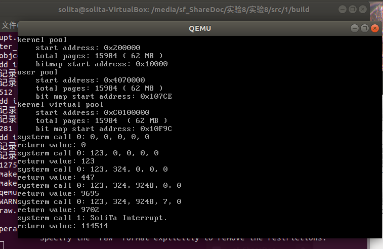

可以看到，在最后一行中，我们自己写的中断1被成功地调用执行了。

然后我们使用gdb，来看看这个过程中发生了什么。

## 1.2 栈的变化情况

我们以第一次调用中断为跟踪目标，也就是跟踪实验指导中实现的中断0。

我们先明确有关栈的寄存器。

- **ESP/RSP**：栈指针寄存器，指向当前栈顶。

- **EBP/RBP/FP**：基址指针寄存器，指向当前栈帧的基址。

因此，根据我们的追踪要求（即观察栈地址），我们追踪基地址`esp`。

首先，我们先编写`gdbinit`，这样我们启动`debug`时就能一步到位开始调试了。

```bash
target remote:1234
file ../build/kernel.o
set disassembly-flavor intel
b setup_kernel
c
b 66
c
```

启动虚拟机，开始调试。

```bash
make debug
```

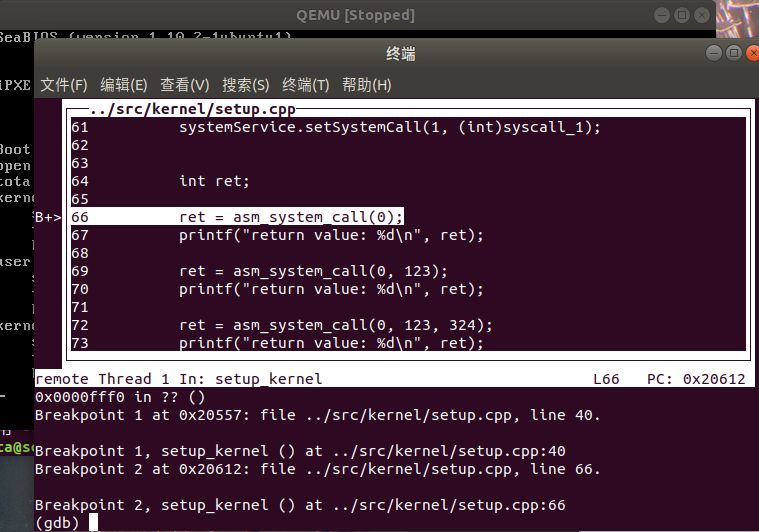

在调用中断前，中断向量表中已经存储好了我们函数的位置。因此在这个系统调用函数中，函数做的事情只有

保护现场，调用`int 80`和还原现场。

我们重点观察`int 80`后发生了什么。

首先，根据我们的预测，因为我们此时处在内核环境中，因此我们现在的特权级别是0，也就是最高。即使我们转到了中断寄存器，我们的特权级别依然没变，因此栈的地址，**理应来说并不会发生改变**。

为了验证我们的猜想，我们停到那，然后用`i r`观察此时的`ebp`寄存器。

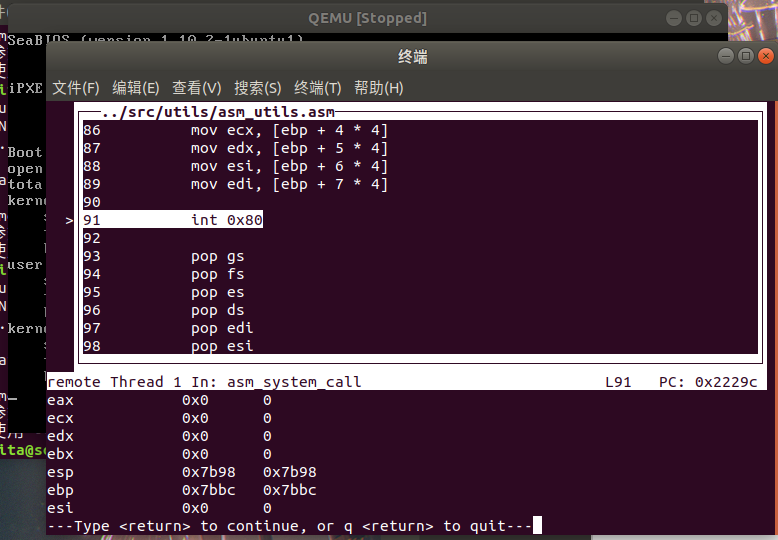

可以看到，此时的`esp`是`0x7b98`。

我们执行到`int 80`之后直接`s`单步进入，发现我们进入了`asm_system_call_handler`函数。这是合理的。因为我们在`syscall`的初始化时，把`0x80`的中断处理函数替换成了它。

```cpp
void SystemService::initialize()
{
    memset((char *)system_call_table, 0, sizeof(int) * MAX_SYSTEM_CALL);
    // 代码段选择子默认是DPL=0的平坦模式代码段选择子，DPL=3，否则用户态程序无法使用该中断描述符
    interruptManager.setInterruptDescriptor(0x80, (uint32)asm_system_call_handler, 3);
}
```

然后我们继续。

单步执行，再进行`i r`，我们得到了如下结果。

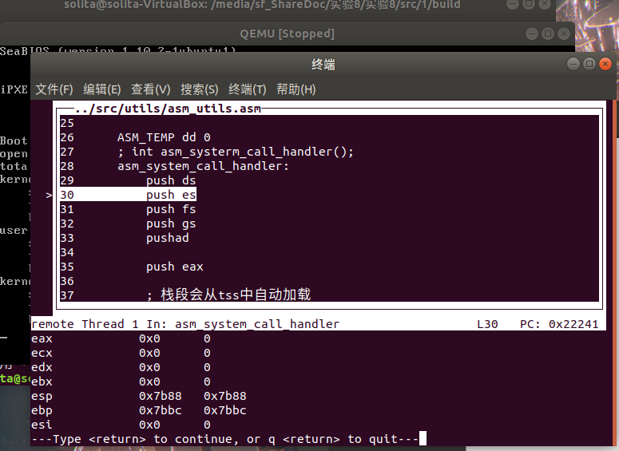

可以发现，`esp`因为压了一个栈所以往低地址延展了而且只延展了一个`0x10`。根据代码前面压了一个十六位的寄存器值，我们可以得出结论：跳转时栈顶寄存器内容没有发生改变。

这正好符合我们的猜想。`esp`没有改变。

那如果是用户空间呢？用户空间的话就会改变吗？

为了证实这一点，我们将这个系统调用移植到`src3`中。

### 1.2.1 在实现了用户进程中的代码中编写系统调用

移植的过程和`src1`的处理方法如出一辙。只是我们不再在内核中调用，而是在进程中调用。

进程也是帮忙实现好的了，调用也较为简单。

```cpp
void second_process()
{
    asm_system_call(1);
    asm_halt();
}

void first_thread(void *arg)
{
    printf("start process\n");
    programManager.executeProcess((const char *)first_process, 1);
    programManager.executeProcess((const char *)first_process, 1);
    programManager.executeProcess((const char *)first_process, 1);
    programManager.executeProcess((const char *)second_process, 1);
    asm_halt();
}
```

最后运行的结果如下。可以看到符合我们的需求。

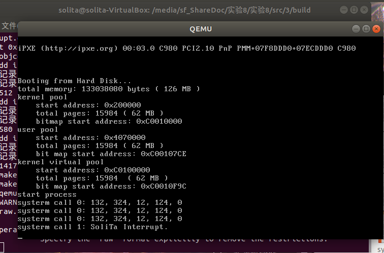

### 1.2.2 观察`esp`是否发生改变

我们再度追踪。

我们知道，想要切换到另一个进程，需要等待时间片流转算法切换进程过去才能开始执行。

我们此次并不追踪进程的实现过程，因此我们直接在`first_process`打断点，从那里开始追踪。

因此需要将原先的`gdbinit`的`b 66`修改成子函数所在的行数再运行。

```bash
target remote:1234
file ../build/kernel.o
set disassembly-flavor intel
b setup_kernel
c
b 37
c
```

编译运行之后，再度追踪到`int 80`的位置，观察此时的`ebp`。

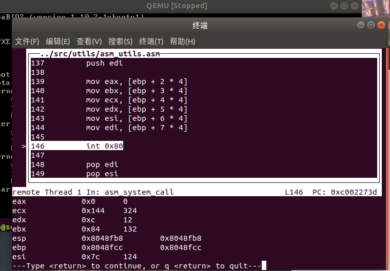

这个时候的`esp`是`0x8048fb8`。因为我们是在用户进程中，用户进程的特权级是3而中断后的特权级是0，这一次`esp`一定会发生改变。

我们执行到下一步再看寄存器的内容。

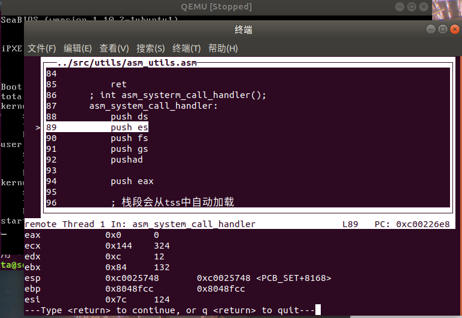

跳转结束之后，`esp`的值骤变成`0xc0025748`。很显然，这不是原地址压了一个16位寄存器的结果，这是栈指针直接发生了改变。

这也符合我们的预测，`esp`跳转到了内核空间中的栈。

而且仔细观察这个栈的位置，是不是有点熟悉？

没错，这个栈指针正好位于虚拟地址的3~4GB的虚拟地址空间中，这正好也是内核空间的共享地址！据此我们可以完全确定，此时就是从特权级为3的内核空间跳转到了特权级为0的内核空间，内核接管了操作系统。

据此我们已经了解了栈的变化了。

## 1.3 TSS的功能

从上述的描述，我们已经知道，TSS能帮助CPU读取到特权值为0的栈。

那TSS是怎么被CPU读取到的？

其实我们手动创建了一个TSS，然后我们把TSS的地址传到了一个叫TR的寄存器中。

TSS的修改都是在时钟中断发生时，中断处理函数切换进程的同时修改的。

我们没有办法直接观察TR寄存器的内容，但是gdb调试可以直接打印tss的内容，十分方便。因此我们可以追踪一下TSS的变化情况。

我们把`gdbinit`修改成如下。

```bash
target remote:1234
file ../build/kernel.o
set disassembly-flavor intel
b ProgramManager::activateProgramPage
c
```

运行到`tss.esp0`发生改变的地方，我们观察到

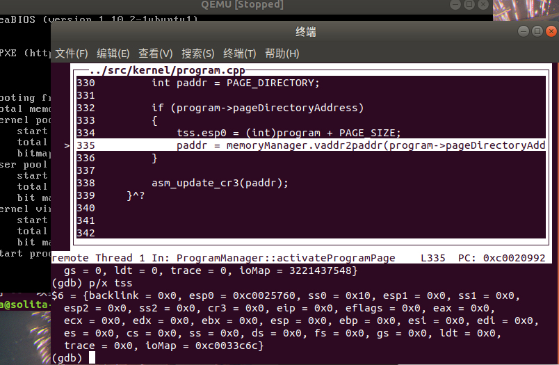

可以发现，`tss.esp0`的地址发生了改变。

我们看一看这个数字`0xc0025760`。正好是上面我们监测栈变化时附近的指针！

所以可以预见到，`tss`的读取是CPU自带的，而`tss`的更改则是我们自己给他进行赋值的。而为什么`tss.esp0`会发生这样的改变？因为我们给进程设计的PCB中就规定了进程第一页后面跟着特权值为0的栈！

这样就解释通了`tss`发挥作用的全流程。

# Assignment 2

实现fork函数，并回答以下问题。

- 请根据代码逻辑和执行结果来分析fork实现的基本思路。
- 从子进程第一次被调度执行时开始，逐步跟踪子进程的执行流程一直到子进程从`fork`返回，根据gdb来分析子进程的跳转地址、数据寄存器和段寄存器的变化。同时，比较上述过程和父进程执行完`ProgramManager::fork`后的返回过程的异同。
- 请根据代码逻辑和gdb来解释fork是如何保证子进程的`fork`返回值是0，而父进程的`fork`返回值是子进程的pid。

## 2.1 `fork`实现思路

`fork`函数的实现，本身就是回答实验指导上的四个问题：

1. 如何实现父子进程的代码段共享？
2. 如何使得父子进程从相同的返回点开始执行？
3. 除代码段外，进程包含的资源有哪些？
4. 如何实现进程的资源在进程之间的复制？

现在在此做出回答：

- 第一个问题，我们回想一下，每个进程的虚拟页表中，3~4GB空间都是用来和内核共享的。这意味着，进程与进程之间也可以通过这部分空间共享。而在上次的实验中，我们把代码段放在了这个共享空间中！那么这段空间就是父子进程的共享代码空间，这是天然共享的，源于巧妙的代码设计。

- 第二个问题，我们先要理清楚整个创建子进程的流程。

  - 首先父进程暂停。
  - 父进程将数据段、栈段等其他资源复制到子进程中。
  - 进程创建完毕之后，如果我们要立刻执行子进程，那么先执行子进程。
  - 子进程执行完之后，返回给父进程暂停位置接手，继续执行。

  关键在第四点，子进程怎么知道父进程在哪里暂停？

  其实也很简单。关注第二点，**父进程将数据段、栈段等其他资源复制到子进程中**。这意味着，父进程的所有栈内容都原样复制过去了，只要子进程不清空栈，那么子进程执行完之后，栈剩余的内容就是父进程的内容了。

  然后我们在Assignment 1中也提到了，进程切换时，3特权级栈保存了父进程在执行`int 0x80`后的逐步返回的返回地址。

  因此，只要子进程不清空栈，无论是先执行父进程还是执行子进程完再返回父进程，**栈顶都存着父进程的逐次返回地址。**返回时是天然的返回到相同的返回点！

- 第三个问题，根据第二个问题的分析我们也明白了，进程包含着栈（包括所有级别的栈段），PCB、虚拟地址池、页目录表、页表及其指向的物理页。
- 第四个问题，考虑到进程与进程之间没有办法通过直接寻址找到另一个进程数据的物理地址（因为二级分页制度的存在，我们没法准确定位实际的物理页在哪里，只有CPU自动寻址），我们就在内核空间开一个页作为中转站，依靠这个页在父进程和子进程之间复制资源。

四个问题都解决完毕了，那么理解实验指导的代码也就变得轻松了起来。现在我们来跟踪整个创建流程。

## 2.2 跟踪子进程的创建流程

为了搞清楚fork是如何保证子进程的`fork`返回值是0，而父进程的`fork`返回值是子进程的pid，我们从建立进程开始追踪。

我们把函数定在进程调用`fork()`的地方。同时，我们在真正执行`fork()`的进程管理器中打上断点。如下所示。

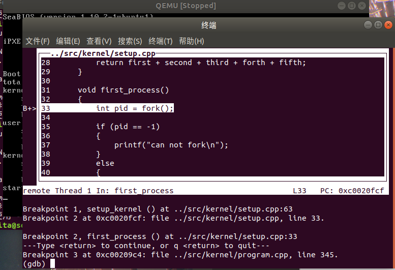

我们遇到一个函数就进入一个函数，这样一直运行下去。直到这一步。

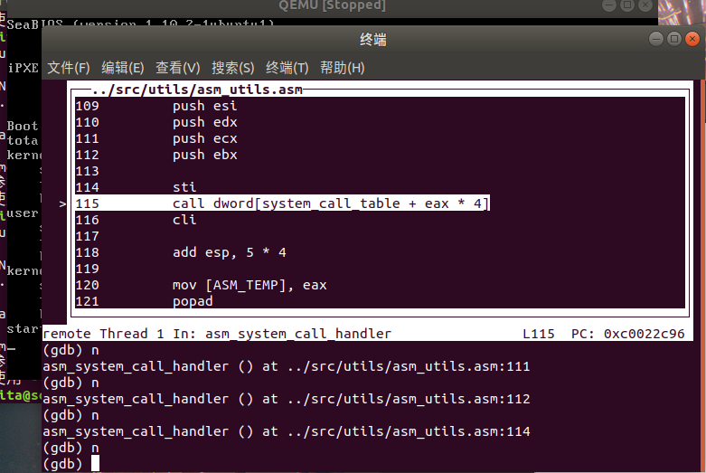

这一步是在`asm_system_call_handler`阶段。前面我们传入了函数号，因此这一步开始就进入了`syscall`部分。

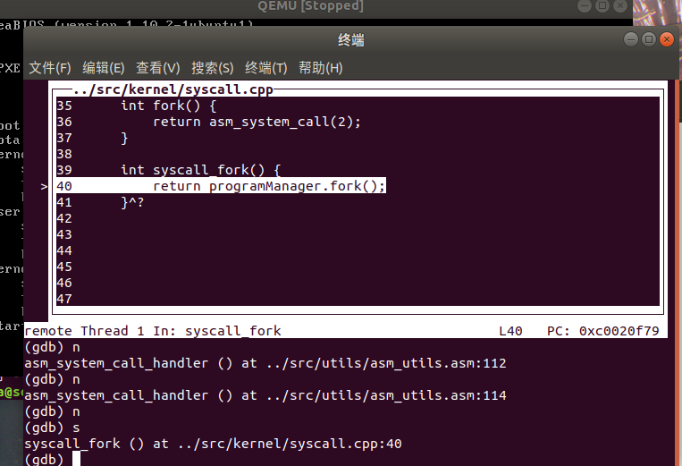

我们可以看到，这里就是调用进程管理器的`fork()`函数。我们进入这个函数继续追踪。

在函数内经历了这样的顺序。

- 判断父进程是线程还是进程。如果是线程就拒绝执行。
- 创建子进程，分配新的PCB。

然后我们来到了关键的复制函数。

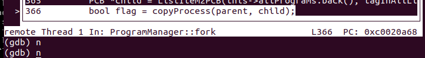

根据代码，这个复制进程干了如下几件事。

- 复制0级栈

- **手动将子进程的寄存器集合中的`eax`设置成0**。

  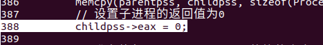

  这是非常关键的一点，这意味着**我们把子进程的返回值设置成了0。至于为什么我会在后面讲述。**

- 将子进程的栈按照启动进程的顺序放入，这一步是为了时间片流转算法切换的时候，能够跳转到启动进程的函数正常启动进程。

- 将子进程的PCB的状态、优先级、进程名字都复制过去。注意，**我们还复制了父进程的PID**。这一步也是关键，为原路返回父进程提供的帮助。

  

- 复制用户虚拟地址池。

- 将父进程的页表都复制过去。注意，这里也相当于把其他等级的栈也给继承过去了。

- 结束

我们跳到函数的最后，看看退出之后到了哪里。

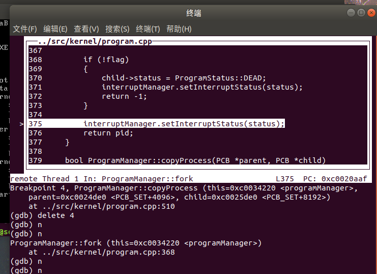

返回到了`fork`中，我们注意！**这里我们返回了一个pid**。这是什么？

观察我们前面的语句，我们发现

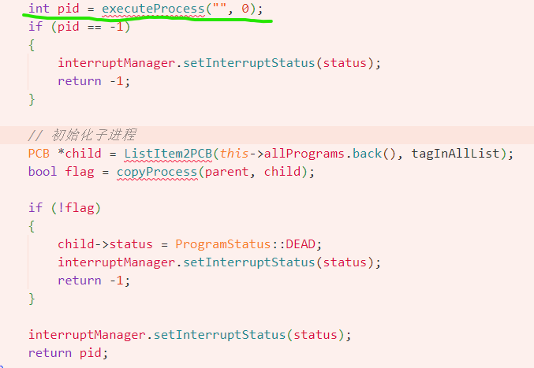

**这就是为什么父进程会返回子进程的pid**。

我们运行完，再看看到哪里了。

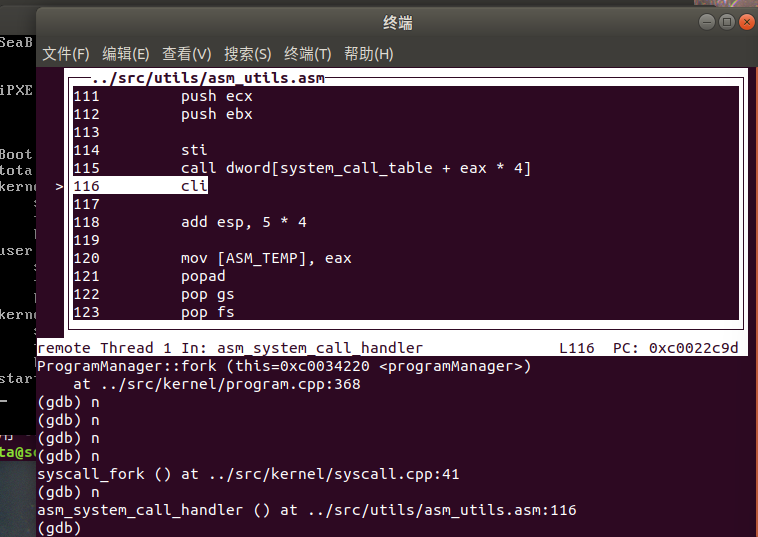

一路返回，到了`asm_system_call_handler`中。

逐步运行，直到我们看到这条指令。

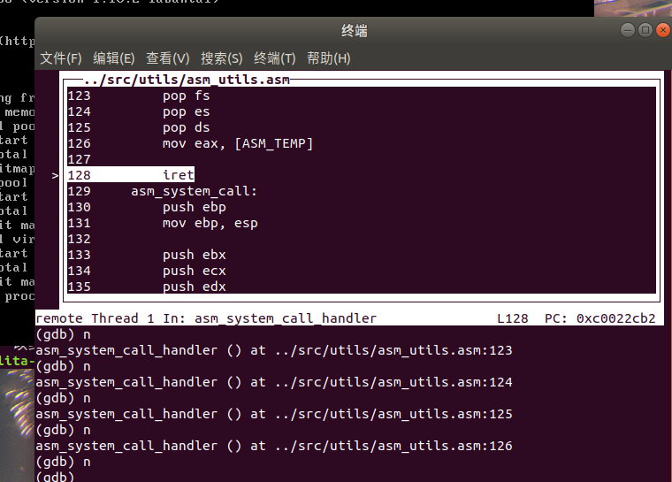

我们已经知道，`iret`指令完成以下操作：

1. 从栈中弹出返回地址（包含CS和EIP寄存器，或CS和IP寄存器，取决于处理器模式），将其放入程序计数器（EIP/IP）和代码段寄存器（CS）中。
2. 如果处理器在保护模式下运行，还会从栈中弹出标志寄存器（EFLAGS）的内容，并将其恢复到标志寄存器中。这包括中断标志（IF），它决定是否允许后续中断。
3. 如果在任务切换过程中，`iret`还会处理任务状态段（TSS）切换。

因此，`iret`这条指令不仅仅只是返回，还将切换优先级。

这里结束一步步退出，就完成了一次子进程的创建。

在父进程中，我们得到的子进程的`pid`，然后一路一路传下来，最终就得到了父进程的pid。

现在我们追踪子进程的执行过程。

## 2.3 跟踪子进程的执行流程

此时要切换到子进程，是靠时间中断函数切换的。

因此我们修改`gdbinit`，堵在`ProgramManager::schedule`门口，再度调试，运行到子进程切换过来的地步。

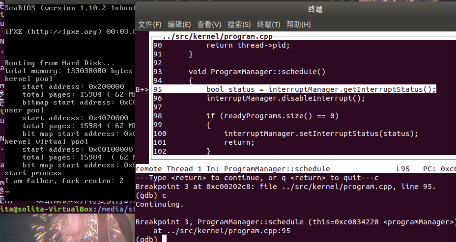

我们连续两次`c`过去，然后关注下面这一个函数，开始追踪这一个函数。

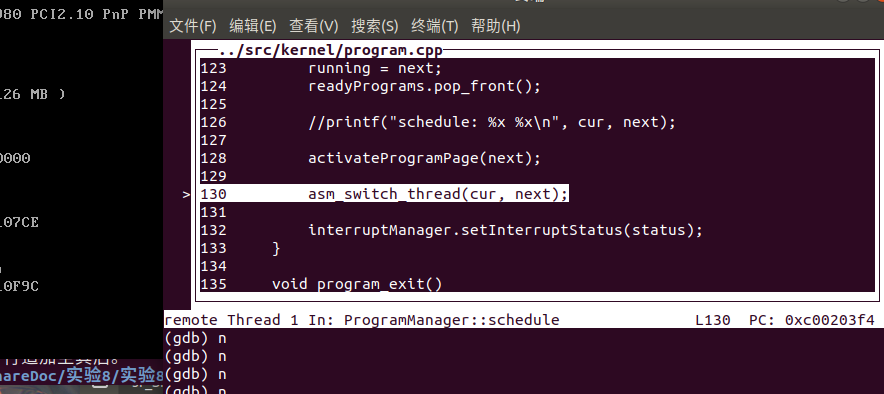

（之所以连续两次`c`过去，因为我在前面的实验报告中提到过，这个时间片轮转调度是存在巨大的BUG的，只是恰好在本实验的内容中可以正常运行罢了。整个BUG的产生原因，以及实际运行时产生的偏差在我之前的实验报告中有很详细的讨论。）

进入函数运行完之后，我们很自然地切换到了`asm_start_process`函数中。

复习一下，我们的子进程0栈中有什么东西？

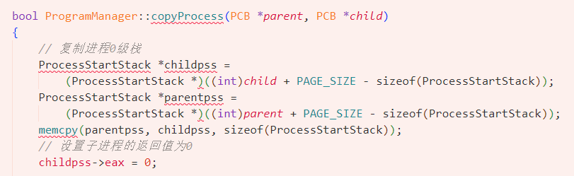

我们现在知道了，这是把父进程的`ProcessStartStack`继承过去了。`ProcessStartStack`的设计是严格依照函数压栈的顺序放成员的，因此可以执行正确的复制。

然后我们再想想，这个时候的`eax`是什么？这个时候的栈指针是什么？

**没错，到这里逻辑就通畅了。子进程此时继承的是运行到`fork`断点的父进程，我们没有清空父进程代码也没有清空子进程的栈。我们最开始更改了`eax`的值为0，这个寄存器是存函数返回值的，我们接下来的所有操作都没有操作过`eax`的值。**

**所以子进程能回到父进程最开始断点一模一样的位置继续运行，所以子进程返回的`pid`是0。**

为了验证这一点，我们把`asm_start_process`执行完，看看运行到了哪里。

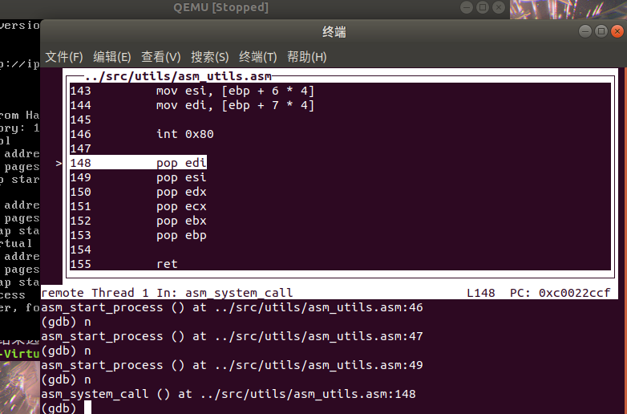

正好是`int 0x80`后面。这是父进程复制完子进程之后返回的地方。在这里，除了`eax`的值是被人工改成了0，所有寄存器的值都是一模一样，包括返回地址。

因此，运行完这里，函数一定会返回到`setup`中的判断`pid`是否为0的函数中。

我们执行完看一看。

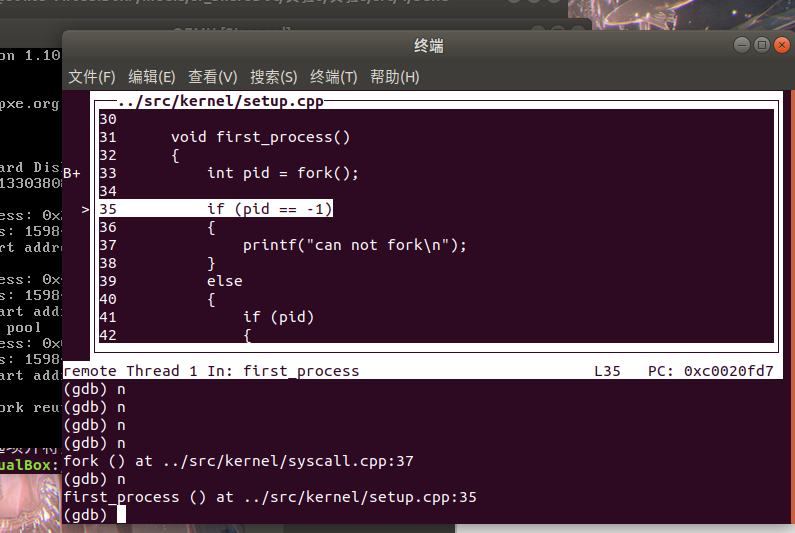

没错，返回到了这里。

至此整个`fork`的流程都很清晰地展示了。

# Assignment 3

实现wait函数和exit函数，并回答以下问题。

- 请结合代码逻辑和具体的实例来分析exit的执行过程。
- 请分析进程退出后能够隐式地调用exit和此时的exit返回值是0的原因。
- 请结合代码逻辑和具体的实例来分析wait的执行过程。
- 如果一个父进程先于子进程退出，那么子进程在退出之前会被称为孤儿进程。子进程在退出后，从状态被标记为`DEAD`开始到被回收，子进程会被称为僵尸进程。请对代码做出修改，实现回收僵尸进程的有效方法。

## 3.1 `exit`的实现原理

我在上述过程详细地讲述了如何在内核态和用户态切换，解释了一个进程的构造，完善了其内容中的各个特级栈段和页目录表页表，还创造出了一个方法新建一个子进程。

现在想要结束一个进程就比构造简单多了。我们只需要释放掉其所有占用的物理页内存和占用的虚拟地址池空间，只保留一个PCB并把进程设置成`DEAD`即可。

而且进程调用在本次实验中，是一旦结束，立刻释放，立刻切换下一个进程。

为了证实这一点，我们在中断处理函数中加入打印函数，然后观察该进程的效果。

```cpp
int syscall_0(int first, int second, int third, int forth, int fifth)
{
    printf("systerm call 0: %d, %d, %d, %d, %d\n",
           first, second, third, forth, fifth);
    return first + second + third + forth + fifth;
}

void first_process()
{
    int pid = fork();

    if (pid == -1)
    {
        printf("can not fork\n");
        asm_halt();
    }
    else
    {
        if (pid)
        {
            printf("I am father\n");
            asm_halt();
        }
        else
        {
            printf("I am child, exit\n");
        }
    }
}

void second_thread(void *arg) {
    printf("thread exit\n");
    exit(0);
}

void first_thread(void *arg)
{

    printf("start process\n");
    programManager.executeProcess((const char *)first_process, 1);
    programManager.executeThread(second_thread, nullptr, "second", 1);
    asm_halt();
}
```

最后我们得到如下结果。

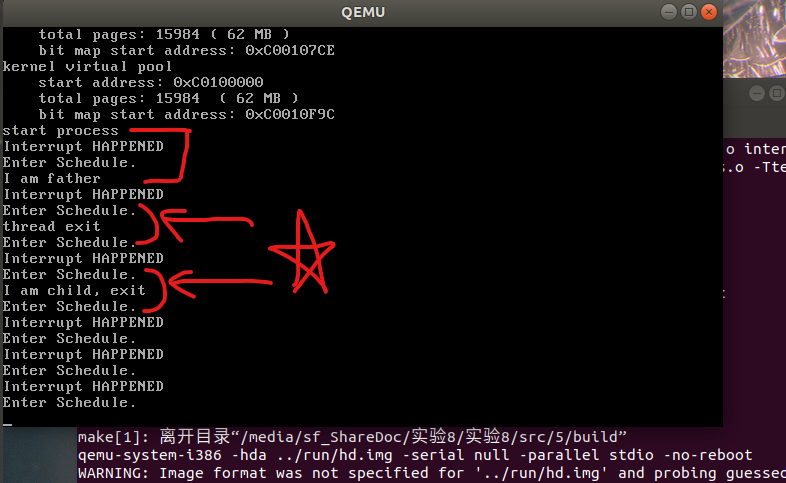

我们仔细观察一下这些打印函数。

- 理应来说，每次调用都应该先中断，再管理，最后打印线程，如第一个方括号。
- 但是关注下面两个圆括号。一个是线程的显示退出，另一个是子进程的隐式退出。我们发现，每次一退出，**Schedule立刻被调用，之后才切换到中断。（正如之前的报告所说，切换到Schedule之所以没有立刻分配到新的进程是实验代码中实现的时间片流转算法本身存在BUG）**

符合我们的预期，退出之后立刻切换到了进程管理函数中。

要怎么实现隐式调用`exit`呢？

原理终究都是从栈里调用。执行一次`ret`决定返回到哪里的都是栈顶的元素决定的。也就是说，只要我们在一个进程开始之前，先往里按照调用进程的顺序压进去一个返回函数，那么当进程结束的时候就可以实现返回啦。

那怎么`ret`是0呢？观察`exit`，我们没有发现有对`ret`的赋值啊？

还是一个道理，根本上来看，一个函数的传参是由函数之后紧跟的几个栈的变量值决定的。

我们观察在加载进程时，把`exit`压进栈的时候还压了什么东西进去。

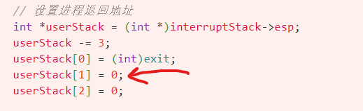

没错，我们默认的传参就是0。

因此自然得到的返回值`ret`也是0。

## 3.2 `wait`的实现原理

通过前面的学习我们知道了，只要我们想让函数停在某个地方，调用`ProgramManager::schedule`立刻把下一个进程切换上来即可。

`fork`通过这个将父进程停留在原本的位置，同样的，`wait`遇到了没有运行完的子进程时，我们在这个时候切换进程，就能把控制权给到下一个进程，让后面所有的子进程继续运行，直到回到父进程时，我们写了一个`while`来让寻找可释放的DEAD子进程不断重复。

同时我来解释一下`wait`中的判断逻辑。

- 如果有一个子进程可以释放，那么直接释放掉，然后直接返回pid。
- 如果没有子进程释放，我们需要判断是没有子进程了还是子进程都在运行，这是根据`flag`判断的。
  - 如果没有子进程了，就返回-1。
  - 如果都在运行，就切换进程。

具体体现在这个地方。

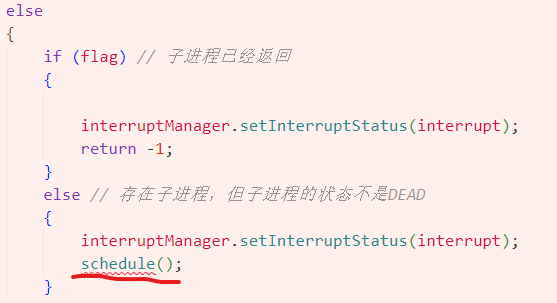

而等待到所有进程结束的判断就写在`setup`中。我们在上面只有一种情况会返回`-1`。


这样整个流程都打通了。我们使用一个判例进行测试。

```cpp
int syscall_0(int first, int second, int third, int forth, int fifth)
{
    printf("systerm call 0: %d, %d, %d, %d, %d\n",
           first, second, third, forth, fifth);
    return first + second + third + forth + fifth;
}

void first_process()
{
    int pid = fork();
    int retval;

    if (pid)
    {
        pid = fork();
        if (pid)
        {
            while ((pid = wait(&retval)) != -1)
            {
                printf("wait for a child process, pid: %d, return value: %d\n", pid, retval);
            }

            printf("all child process exit, programs: %d\n", programManager.allPrograms.size());
            
            asm_halt();
        }
        else
        {
            uint32 tmp = 0xffffff;
            while (tmp)
                --tmp;
            printf("-CHILD 2 EXIT- pid: %d\n", programManager.running->pid);
            exit(123934);
        }
    }
    else
    {
        uint32 tmp = 0xffffff;
        while (tmp)
            --tmp;
        printf("-CHILD 1 EXIT- pid: %d\n", programManager.running->pid);
        exit(-123);
    }
}

void second_thread(void *arg)
{
    printf("thread exit\n");
    //exit(0);
}

void first_thread(void *arg)
{

    printf("start process\n");
    programManager.executeProcess((const char *)first_process, 1);
    programManager.executeThread(second_thread, nullptr, "second", 1);
    asm_halt();
}
```

我们来解释一下这个代码运行起来的逻辑。

- 首先我们第一次`fork`，产生第一个子进程。
- 然后父进程进入判断，判断成功，再产生第二个子进程。
- 父进程执行`wait`，开始等待。
- `wait`函数检查到所有子进程都没结束，立刻切换到下一个进程。
- 切换到第一个子进程，从最外层的判断开始（回忆一下，子进程可是能从父进程相同的返回点开始执行的），判断失败，进入释放部分。
- 切换到第二个进程，从内层判断开始，判断失败，进入释放部分。
- 父进程接手时两个子进程都没执行完，所以继续等待。
- 两个子进程最后都执行完毕结束。
- 父进程接手时发现可以回收，开始回收第一个，回收完之后判断还有一个，继续回收，最后退出`wait`，打印结束语句。

最后运行成功后结果如下。

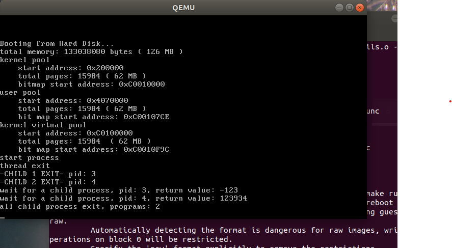

与我们的推理一致。

## 3.3 回收僵尸进程

我们先构造出会出现僵尸进程的情况。

```cpp
void first_process()
{
    int pid = fork();
    int retval;

    if (pid)
    {
        printf("MAIN EXIT.");
    }
    else
    {
        uint32 tmp = 0xffffff;
        while (tmp)
            --tmp;
        printf("-CHILD 1 EXIT- pid: %d\n", programManager.running->pid);
        exit(-123);
    }
}
```

运行结果如下。

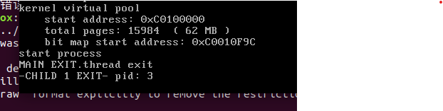

可以看到主进程确实在子进程之前释放，造成了僵尸进程。

现在我们来回收僵尸进程。

首先既然是僵尸进程，那么`wait`的判断条件就放宽了，只要检测到PCB还有**非零**父亲信息就判定成还有子进程。

为了方便起见，我将`wait`函数直接修改成了一个专用于释放僵尸进程的函数。

```cpp
int ProgramManager::wait(int *retval)
{
    PCB *child;
    ListItem *item;
    bool interrupt, flag;

    while (true)
    {
        interrupt = interruptManager.getInterruptStatus();
        interruptManager.disableInterrupt();

        item = this->allPrograms.head.next;

        // 查找子进程
        flag = true;
        while (item)
        {
            child = ListItem2PCB(item, tagInAllList);
            if (child->parentPid)
            {
                flag = false;
                if (child->status == ProgramStatus::DEAD)
                {
                    break;
                }
            }
            item = item->next;
        }

        if (item) // 找到一个可返回的子进程
        {
            if (retval)
            {
                *retval = child->retValue;
            }

            int pid = child->pid;
            releasePCB(child);
            interruptManager.setInterruptStatus(interrupt);
            printf("-RECYCLE ZOMBIE CHILD SUCCESS- pid=%d",pid);
            return pid;
        }
        else 
        {
            if (flag) // 子进程已经返回
            {
                
                interruptManager.setInterruptStatus(interrupt);
                return -1;
            }
            else // 存在子进程，但子进程的状态不是DEAD
            {
                interruptManager.setInterruptStatus(interrupt);
                schedule();
            }
        }
    }
}
```

加一个打印函数，验证是否成功回收。

然后我们自己新开一个线程，用来执行这个回收函数。毕竟父进程直接没了，我们自然要新开一个线程回收。

```cpp
void second_thread(void *arg)
{
    int retval;
    wait(&retval);
}
```

然后我们运行观察结果。

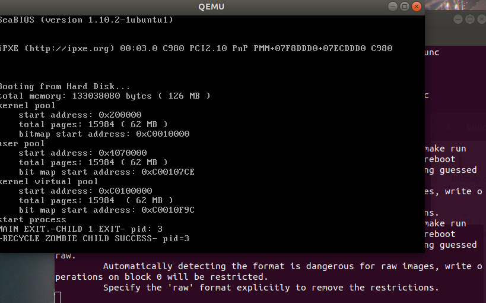

可以看到，最后僵尸进程回收成功了，且`pid`是对应的上的。

# 结语

我们最终完成了所有实验内容。

然后我注意到，还有一个`src7`没有使用到。这个实验代码封装了一个`Shell`用来在进程内实现打印函数。

原理也是依靠利用中断切换优先级从而调用显存。

我执行了一下这段实验代码。

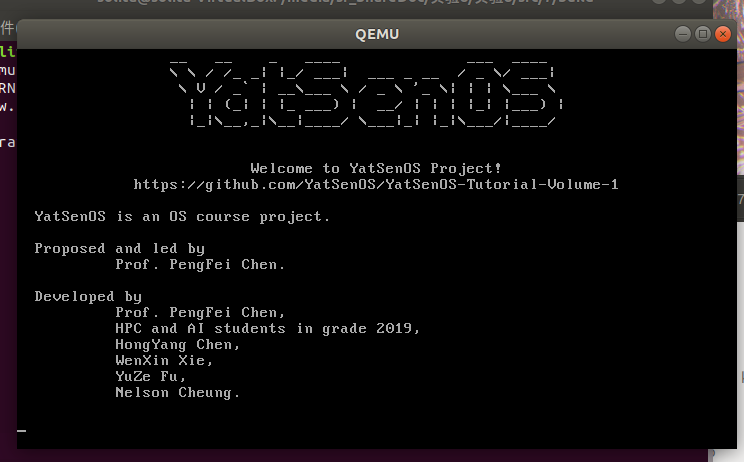

这是一个`YatSenOS`的欢迎界面。看着这个界面感慨颇多，实验指导的制作者依靠一个`Shell`完成了这次实验课程颇有仪式感的谢幕。

在本次实验课程中，我学习到了很多操作系统的底层原理，学会了非常熟练地编写汇编代码，学会了很多编写大项目时所需要具备的知识，包括联合编译。当然最重要的是给了我一个入门操作系统的机会。

当然，操作系统是一个非常庞大的系统，本次实验也只是将最基本的内容传授了给我。即便如此，每一次的实验都带给我非常大的挑战，我需要投入大量的时间才能彻底理解每一行代码的含义。本次实验课程也许是我投入时间与精力最多的课程了。在学习的过程中，我能感受到实验指导的优秀超乎想象。

实验指导编写的内容非常非常详尽，每一个实验指导都是近乎两万字的超级教程，虽然存在很少的逻辑问题和代码问题，但是也正是因为指导老师和2019级学长们极度认真的态度，每一个复杂的实验才会变得更加易懂，也帮助我少走特别多弯路。每一个可能出现的细枝末节的问题，实验指导中都尽可能详细地给出了他们的解释。

考虑到参与者中大部分都是学生，我更加敬佩他们的努力与实力，更加感激他们做出的贡献。

在此致谢参与编写`YatSenOS`的指导老师和所有学长！

